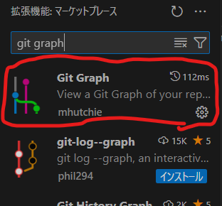
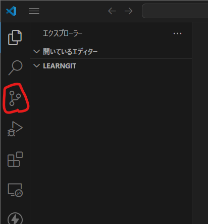
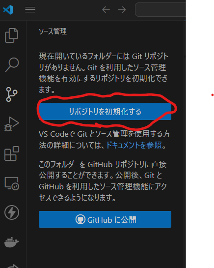
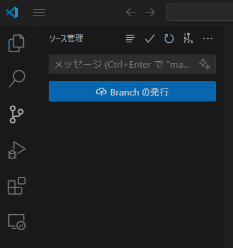
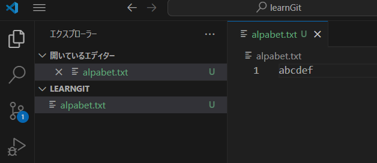
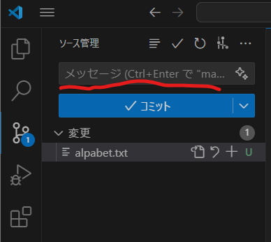
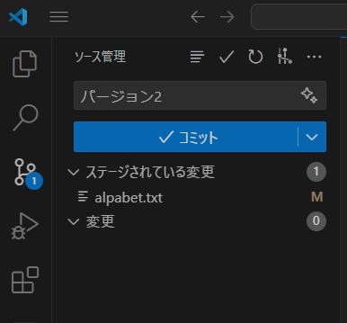
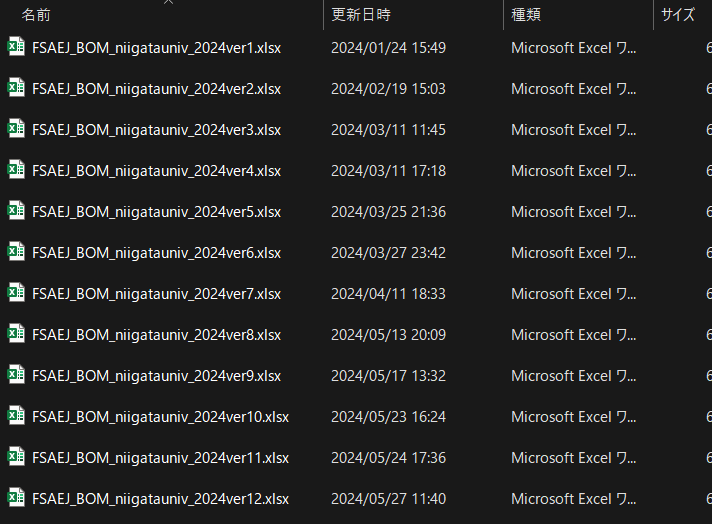
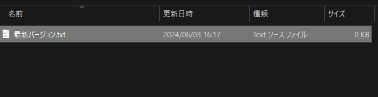

# 手を動かしながらgitを学ぼう
## 1. 環境構築
必要なものは以下の3つ。 
1. VSCode  
[うちのチーム向けのVSCodeの環境構築](https://qiita.com/nextfp/items/de702b7f90c581eaee72)

2. git  
[Windowsのインストール方法](https://prog-8.com/docs/git-env-win%20)  
[Macのインストール方法](https://prog-8.com/docs/git-env)  

3. GitHubアカウント  
うちのチームのアカウントでも良いが、個人のアカウントを作成しても良い。  
なぜ、アカウントを作るのを勧めるかは「GitHub Student Developer Pack」とググると分かる。  
> 3大大学生の特権「Amazon Primeが半額」「Spotifyが半額」「GitHub Student Developer Packで様々なサービスで優待が受けられる」  

## 1.5 VSCodeでGit Graphを入れる  
説明の都合上視覚的に分かりやすいので、Git Graphを入れる。普段使いとしても優秀なので、入れておくと良い。  
拡張機能のところで「Git Graph」と検索してインストールする。  
  

## 実践編

こちらからどうぞ
[実践編](https://zenn.dev/ukwhatn/books/8607f78c3a2da4/viewer/4791ce)

<!--
## 2. とりあえず使ってみよう。  
### 2.1 gitを使うための下準備
まずは、好きなところに作業用のフォルダを作り、そこでVSCodeを開く。　　
次に、画像の赤丸の箇所を開く。この赤丸のアイコンを`gitアイコン`、gitアイコンをクリックして出てくるタブを`gitタブ`と呼ぶことにする。  

ごちゃごちゃ書いているが、`リポジトリを初期化する`を選ぶ。    
  
このような画面になる。  
  
ここまで、何をしているかサッパリ分からないと思う。でも、gitを使うための準備をしているんだなっていう認識でOK。  

### 2.1 first commit
では、とりあえず新しいファイルを作ろう。ファイル名は`alphabet.txt`にした。  
このファイルにはアルファベットを書いて保存していく。  
とりあえず、ファイルの中身は以下の通りにしてほしい。  
```txt
abcdef
```
a~fまでのアルファベットを書いた。  
  
すると、さっきの`gitタブ`に未読件数みたいなやつが表示される。  
見に行くと、先ほどの画面とはちょっと違う画面になっている。  
とりあえず、メッセージと書かれたテキストエリアに`first commit`と書いて、`✔コミット`をクリックする。
  
未読件数が消えて、また`Branchの発行`と書かれた画面に戻る。  
  
### 2.2 2回目のコミット  
流石に`alphabet.txt`という名前のくせに、a~fまでしか書いていないのは寂しい。せめて、`g`までは書いておこう。  
ということで、`alphabet.txt`を開いて、`abcdef`の末尾に`g`を追加して保存する。  
```diff
- abcdef
+ abcdefg
```  
すると、また`gitタブ`に未読件数が表示される。  
先ほどは、`first commit`と書いて、`✔コミット`をクリックしたが、今度は`バージョン2`と書いて、`✔コミット`をクリックする。  

またもや、未読件数が消えて、`Branchの発行`と書かれた画面に戻る。  

### 3. 座学
そろそろ、何をやっているのかについて解説する。  
  
ここで、「なぜgitを使うのか」について思い出そう。  
> 読んでいない方はこちらから  

この中で、gitを使うとバックアップしているファイルの管理が楽になると書いた。  
この中でKさんの例を思い出そう。  
  
どれが最新のファイルかがバージョン名の数字が一番大きいやつを選べばいいので、分かりやすいと説明した。  
しかし、これだけファイル数が多いと、じっくりファイル名を見なければどれが最新か分からない。  
では、どうすればよいか。  
以下のようになれば、使いやすくなるのではないか

- 最新バージョンが一番アクセスされることが多いので、基本的に最新バージョンのファイルのみを表示する。  
- 過去のバージョンのファイルを見たいときは、過去のバージョンを指定すると、過去のバージョンのファイルが表示される。  
分かりにくいので写真を使いつつ説明する。どれが最新バージョンか分かりにくいなら、最新バージョンしか置かなければいい。つまり、以下の写真のようにする。  
  
それでは、昔のバージョンを見たいときはどうすればいいか。  
なにか特定の操作をすると、昔のバージョンの代わりに昔のバージョンのファイルが表示されるようにすればいい。  

 -->