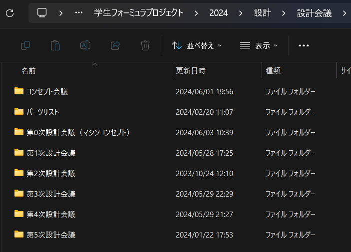
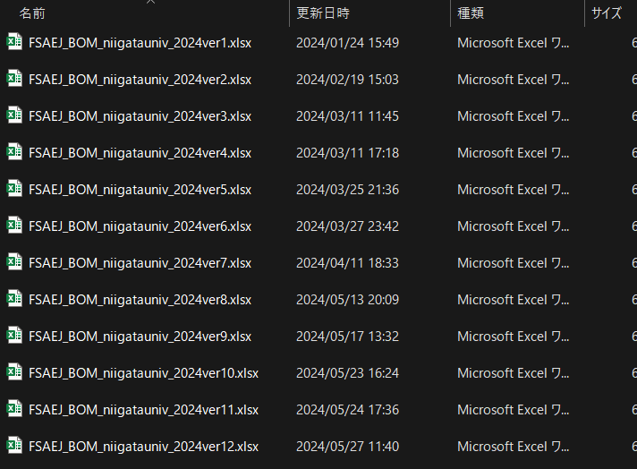
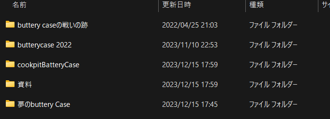
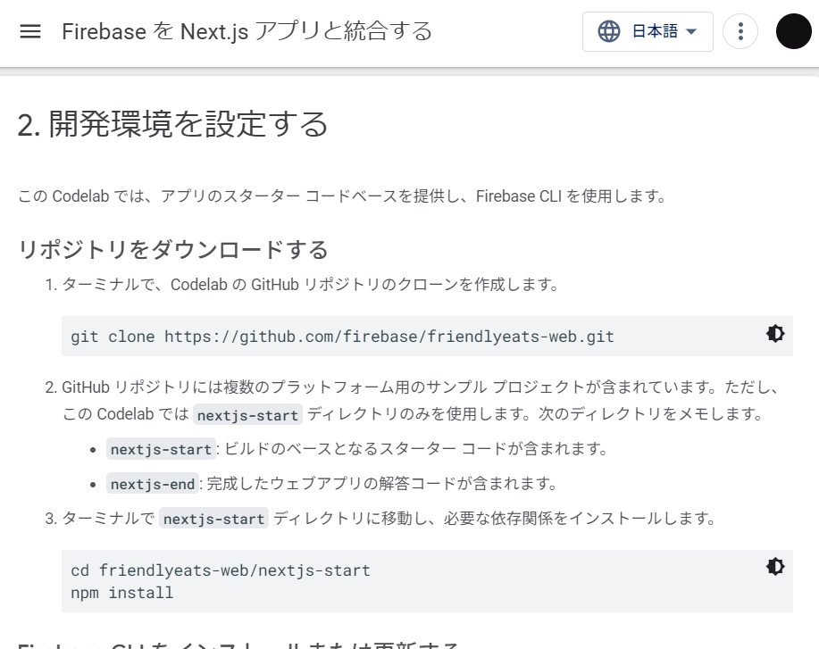
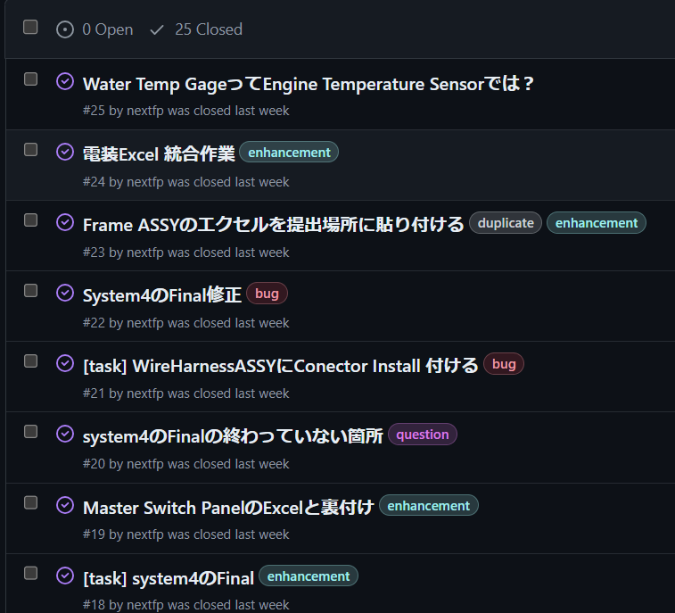

# なぜgitを使うのか
エンジニア目線でgitを理由を説く、ドキュメントは多いが、私たちはエンジニアじゃないので、なぜGitを使うのか分かりにくい。なので、個人的になぜgitを使っているかについて、そのメリットの大きさ順に示す。

### 1. ファイルの管理が楽になる。
「ファイルの管理？」そんな大そうなことがうちのフォーミュラチームはやってなくね？  
そんなことを思ったかもしれないが、実は潜在的に行っている。  
設計会議のフォルダを見てみよう。  
  
このように、設計会議ごとに資料がまとめられている。  
でも、なぜ設計会議ごとにフォルダを作るのか？設計会議というファイルをポンと一つ置いておき、会議が行われる度にそのファイルに上書きするのでは、ダメなのか？
会議が行われる度にファイルを上書きをする場合のメリットとデメリットを以下に考える。  
**メリット**

- どれが最新版か分かりやすい
> 最新版しかファイルがないから。

**デメリット**
- 「ひとつ前の会議の内容が見たいな」と思っても、見れない
- 「どのような流れで設計したのかな」と後の代の人が見に来ても、最新版しか見れない

このように、昔のファイルを残しておくというのは大事なことで、説明されなくても肌感覚で分かっている人も多いと思う。  

じゃあバックアップを取ろうと思った時、どんな感じに管理するのがいいか？  
コストの先生ことKさんが作成したコストのファイルを見てみよう。  
  
このように、ファイルの末尾にver〇〇と数字を振ることで、どれが最新版か分かりやすく、バックアップを取ることができている。やはり仕事のできる男は違うなという感じがする。十分実用的であり、この方法で管理できるのなら、それでいいと思う。  
では、仕事ができない男がこの方法で管理するとどうなるか？
  
ここで、クイズ。どれが最新のバッテリーケースのCADでしょうか？  
ファイルの命名規則をカッチリしないと、こうなるという我ながら素晴らしい例。  
でも、gitを使うと、ズボラな人でも綺麗に管理できる。どのように管理しているかは後ほど。

### 以下のメリットはgitが持っている機能の話ではありません。
なので、サラサラと読み流すように

### 2. プログラマーはみんな使っているから
「俺、別にプログラマーにならんよ」と思っているかもしれないが、みんな使っているせいで、プログラミングをかじり始めてしまった人はgitを使わないと詰む場面が多い。  
例えば、Reactをつかってアプリを作ろうとしてインターネットを彷徨っていたら、[分かりやすそうなドキュメント](https://firebase.google.com/codelabs/firebase-nextjs?hl=ja#1)が出てきたとする。  
  
やるぞ！と思ったら、いきなりgitの使用が必須ということが分かる。gitが使えない人はこれより先に進めない。  
このように、少し深いプログラミングの世界で勉強しようとすると、gitが使えないとドキュメントが読めなくて、詰むという事態が発生してしまう。  
なので、プログラマーにならない人でも、gitを使えるようになると、プログラミングの世界が広がる。  

### 3. 電装の資料が漁れなくなる
私がgitを覚えてから、なるべく色んなことをgitでドキュメントやソースコード、CADを管理するようになってしまった。  
つまり、gitを覚えないと、私の制作したものを見たくなっても見れないということになってしまう。すまんな。  

### 4. GitHubが有能
#### 1. GitHub周辺サービス
この電装wikiは実は、[WEBページとして見れる](https://nextfp.github.io/wiki/)。  
Webページの制作って難しそうだが、GitHub pagesというサービスを使うと、何にもしなくても勝手にWEBページにしてくれる。どちゃくそ便利。  
うちの[チームのページ](https://www.next-fp.com/)は、GitHub pagesではないのだが、似たようにGitでソースコードを編集したことを検知すると、自動でWEBページを更新してくれる。  

#### 2. タスク管理アプリとして使える
GitHubにはIssueという機能がある。これがなかなか便利。  
例えば、[電装のコスト](https://github.com/nextfp/costElectrical/issues?q=)を見てみよう。  

タスクをこのように書き連ね、終わったらCloseするというありがちなToDoアプリだが、gitが絡むことで、いい感じになっている。詳細は後ほど。  
