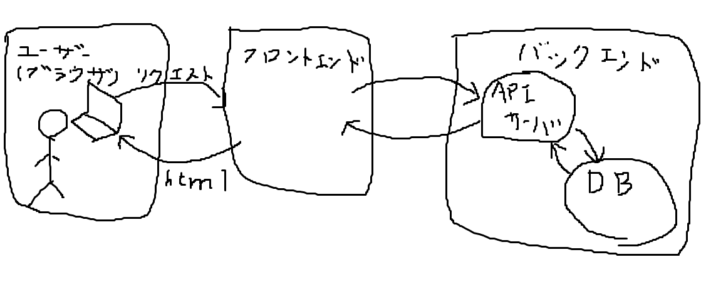
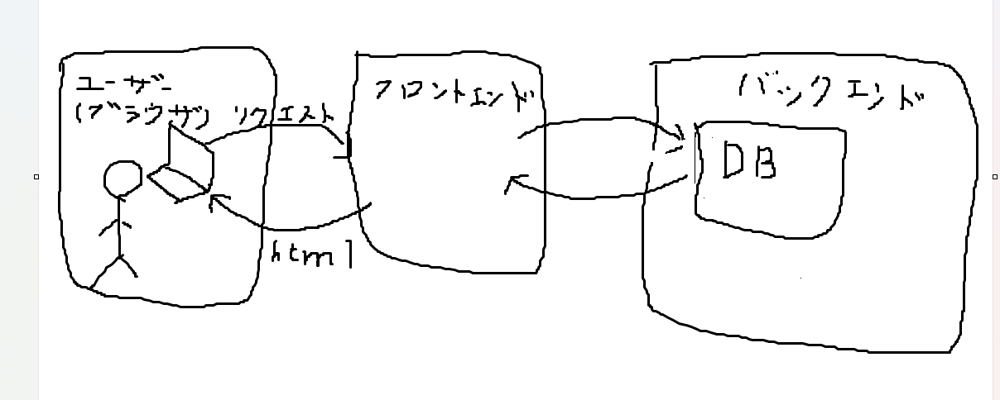

# 雑談のコーナー  
このコーナーは私に実際に会って、話してもらうのがおススメです。  
雑談なんですが、これからの学習にあたり、それなりに重要なことを話しています。    

## Webは2つの世界に分けられるという話
Webというのは2つの世界?分野?に分けられます。  
フロントエンドとバックエンドです。  
境界線は割と曖昧なのですが、これまでの勉強で言うと、
- バックエンド: APIを作ったやつ。  
- フロントエンド: API自作以外は全部。  
こんな感じです。  

境目のイメージを掴むために、Webアプリの基本構造をつかみましょう。  

### フロントエンドについて
まず、htmlページはどのように配信されるのでしょうか？  
まず、サーバーが置かれており、そこにユーザーからリクエストがあると、htmlが返されます。  
ブラウザで表示するhtmlやcss、javascriptを主に製作します。  
ページの配信を担当するサーバーの用意は、最近では自分で用意することは少なく、サーバーを借りたり、ファイルをアップロードするだけで、webサイトを作れるサービスを頼ることがほとんどです。  

### バックエンドについて
バックエンドはまだ、ほとんど触っていないためイメージが掴みにくいと思います。  
なので、この前使った[ポケモンのapi](../JavaScript/pokeAPI)を自分が作るとしたらどのようなものが必要かを考えてみましょう。  
まず、リクエストがあったら、ポケモンのデータを返すサーバーが必要です。この前の[APIサーバーを自作](../JavaScript/pokeAPI_supplyment/)しましたが、あのようなイメージです。    
少し思い出して欲しいのですが、ポケモンのAPIはurlはこんな感じでした。`https://pokeapi.co/api/v2/pokemon/25`この25というのはポケモンのidであり、この数字を変えると違うポケモンのデータが返されるという仕組みになっています。  
ポケモンって1025種類いるらしいです。ここまで大量になると、ポケモンのデータを保存しておくところが欲しくなります。  
これがデータベースです。  
ここまでのイメージをまとめるとこんな感じです。  

バックエンドのAPI層をなくすようなこともできるときもあります。  

## あなたの現在の位置(雑談)

現在はフロントエンドを中心に勉強しており、ある程度フロントエンドが身についたら、軽くバックエンドもやっていく方針です。  
ここで、あなたの現在の位置とこれから進む位置を見てみましょう。  
  
くそほどデカイ画像がでてきました。  
これは何かというと、海外の有志が作っている、フロントエンドエンジニアとして働くにはこのようなことをこのような順番で身に着けたら良いよということを示しているロードマップです。  
エンジニアになる人はこういうのを参考に勉強をしたりしています。(私はあんまりしてないけど)  
では勉強時間でいうと20時間くらいはしたと思うんですけど、このロードマップで言うとどのくらいまで進んだでしょうか？  
  
こんな感じです。おもったより進んでいたでしょうか?それとも、進んでいなくてショックだったでしょうか？  
  
でも落ち着いてください。これは、優秀なエンジニアとして働くために身に着けるべき知識が表示されているだけであり、私たちはエンジニアを目指しているわけではありません。マイコンでWebアプリを作るのが目標です。だから、この通りにやる必要はなく、私も学習量が少なくなるルートを考えて、このドキュメントを書いています。  
ということで、現在(執筆時)htmlとjavascriptしかドキュメントを書いていませんが、これからの勉強する予定のものを青〇で囲ってみました。  

結構青〇が多いですが、軽いものも多いので、重い内容のものを紫で囲んでみました。  

青〇で示したものを簡単に分類してみます。  
- node.js周辺
- React
- typeScript
- NEXT.js
こんな感じの4つです。  