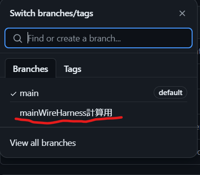

# Excelのやり方

基本的に去年のコピペで、ok。  

もし、なんだこれっていう項目があったら、マテリアルテーブルとかプロセステーブルとかで確認しよう。  
マテリアルテーブルやプロセステーブルはコストテーブルという名前で、たぶんコスト資料のExcelの中に入っている。  

## 配線の数の数え方  
  
Main Wire Harnessの計算用のブランチがあるので、これを使い、Excelの配線の長さを計上する。  
  

## 後は作業ゲー
ちなみに、そこまで作業量は多くない。頑張ろう。  

## その他メモ

- Cut wire: ワイヤーの切断
- Strip Wire: ワイヤーの被膜を剥く
- Crimp WIre: 圧着
- Connecor Assembly, Crimp: コネクターの圧着と取り付け
- Attach Wire, Solder Wire, bent: はんだ付け
- Connector install, Square, Friction: ヒューズボックスに組み付けるときの専用
- Assemble, 1kg Loose: ヒューズボックスに組み付けるとき専用
- Insert Bundle Into Tube or Sleeve: 熱収縮チューブを配線に通す
- Shrink Tube: チューブを縮ませる  
  
計上の切断と配線合計が同じになる。  

## githubのissueを見る
cost Electricalのリポジトリのissueを見てみると、去年も同じ箇所で詰まっていたかもしれないので、見てみると面白いかも。  
特に疑問に思ったことについては、紫色の`question`ラベルが付けられている。  
