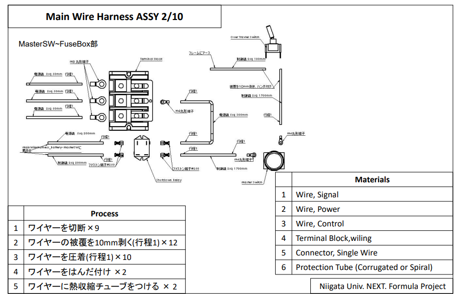

# 裏付け
## 1. 裏付けとは
裏付けとは図面で示せないExcelのプロセスを証拠と残すためにやるものである。  
例えば、放電するとしたら図面ではどのくらいの量切るか分からない。片面しか加工しなきゃいけないとかあるかもしれない。  
そのために裏付けで証明する。  

## 2. 裏付けの見本
2023年のコスト審査のフィードバックは`\\133.35.154.50\学生フォーミュラプロジェクト\2023\コスト\動画`にある。  
その中に電装の裏付けの見本が示されている。それを参考にしてほしい。  

## 3. 裏付けの回路図の場所
GitHubのWiring Diagramの中にある。  
NU24は面倒で、drawioで回路図を作ってしまったが、裏付けの見本もCADを使って回路図を描いている。  
CAD図もdrawioの図もどちらもWiring Diagramリポジトリにある。  

## 4. 書いた方がいいもの
  

- マテリアルの表
- プロセスの表
などエクセルの証拠となるもの。  
