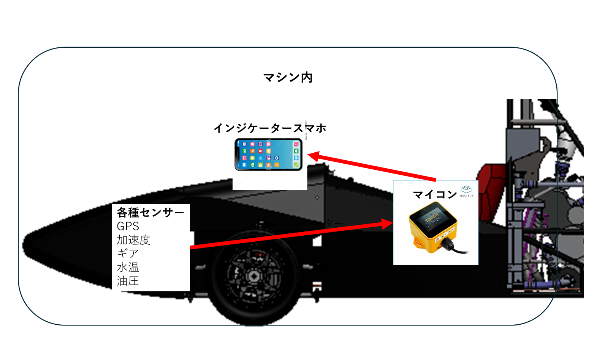
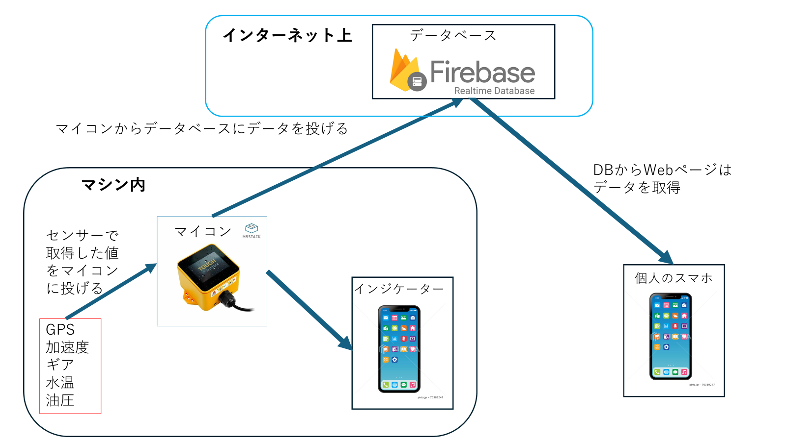
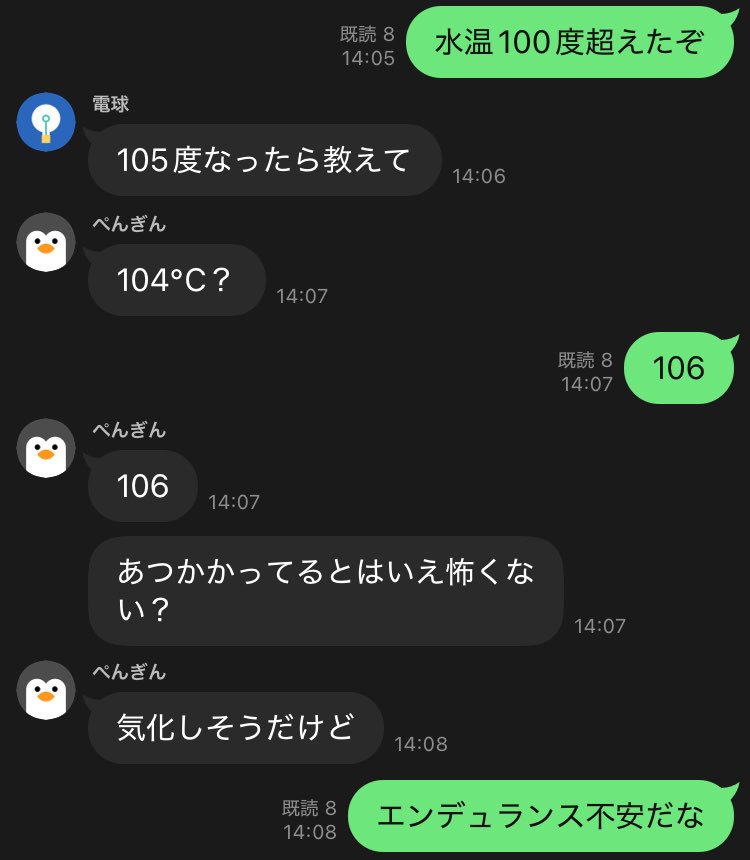

# 自作インジケーターと遠隔監視システムの開発記録**

## **開発のきっかけ**

僕たちの大学の学生フォーミュラチームが、ディスプレイ周りのシステムを自作するに至った理由は主に3つです。

1.  **予算の制約**
    市販のディスプレイやセンサーキット（AIM社製など）は高価で、一式で約30万円します。チームの予算では厳しいため、「自作すればコストを抑えられ、面白いものができるのでは」と考えました。

2.  **走行性能向上のため**
    チームとして、ただ完走するだけでなく、より高い走行性能を目指すフェーズに入っていました。そのためには、ドライバーの感覚頼りの設計から脱却し、数値データに基づいた改善が必要です。センサーを取り付け、マシンの状態を定量的に評価する基盤が求められていました。

3.  **F1への憧れ**
    F1マシンに搭載されているような、ハンドル一体型のディスプレイは、フォーミュラカーを作る者としての憧れでした。「自分たちのマシンにも搭載できればモチベーションが上がるし、表現の幅も広がる」という思いがありました。

## **STEP 1：初代構想 - スマホを利用した基本システム**

まずは、ドライバーに車両情報を表示するインジケーターの開発から着手。主な要件は、水温とギアポジションの表示です。

  * **ディスプレイ**
    マイコン制御のディスプレイも検討しましたが、日中の屋外での視認性を確保できる高輝度なモデルは高価でした。そこで、安価な中古スマホをディスプレイとして使うことにしました。スマホはバッテリーを内蔵しているため、ハンドルへの電源配線が不要になり、脱着式のハンドルに適しています。

  * **表示方法**
    センサーデータの表示にはWebアプリ形式を採用しました。スマホの故障といった不測の事態にも、別の端末のブラウザを開けばすぐに代替できる手軽さを重視しました。

  * **マイコンと通信**
    センサー信号の読み取りとスマホへのデータ送信は、防水性があり扱いやすい「M5Stack Tough」が担当します。
    通信方式は、センサーとマイコン間を**有線**、マイコンとスマホ間を\*\*無線（WebSocket）\*\*とする構成にしました。
    これについて、私が書いた技術的な部分をまとめた記事は以下の記事です。
    *(詳細: [私が書いたQiita記事](https://qiita.com/nextfp/items/ffac9f3a76d5725f056f))*

## **STEP 2：2代目構想 - 遠隔データ監視機能の追加**

スマホの4G通信機能を使えば、センサーデータをクラウドに送信できることに気づきました。これにより、ピットにいるメンバーがリアルタイムでマシンの状態を監視できる「遠隔監視システム」のアイデアが生まれました。バックエンドには、開発を効率化できる**Firebase**を使用することにしました。

## **STEP 3：3代目構想 - GPSの利用方法の変更**

当初、車速の計測にはマイコンに接続したGPSセンサーを使う予定でした。しかし、使用していたセンサーの性能では、電源投入後の測位に時間がかかるという問題がありました。

そこで、より高精度で測位も速い、**スマホ本体のGPS**を利用する方針に変更しました。
これについて、私が書いた技術的な部分をまとめた記事は以下の記事です。
*(詳細: [Qiita記事](https://qiita.com/nextfp/items/b733625b744ea76c2cdd))*

## **直面した技術的な問題**

ここで、仕様上の問題が発生しました。

  * WebアプリでスマホのGPS情報を取得する「Geolocation API」は、セキュリティ上の理由から\*\*「HTTPS」\*\*（暗号化通信）のページでしか使用できません。
  * しかし、マイコンが立てたサーバーとスマホのWebSocket通信は\*\*「HTTP」\*\*（非暗号化通信）で行っていました。

この仕様により、「HTTPS」のページから「HTTP」のサーバーへアクセスしようとすると、ブラウザの混合コンテンツポリシーによって通信がブロックされてしまいます。つまり、スマホのGPSを使おうとすると、マイコンと通信できなくなるという問題でした。

## **解決策：Web Bluetooth APIの採用**

この問題の回避策を3ヶ月ほど検討した結果、**Web Bluetooth API** を使う方法にたどり着きました。

ブラウザから直接Bluetooth通信を行うこのAPIは、HTTP/HTTPSの通信プロトコルとは無関係です。そのため、ブラウザのセキュリティポリシーに影響されることなく、マイコンとスマホ間で安定した通信を確立できました。
これについて、私が書いた技術的な部分をまとめた記事は以下の記事です。
*(詳細: [Qiita記事](https://qiita.com/nextfp/items/59e0b4e38d719c9eef31))*

## **完成したシステム**

大会直前の追い込みで完成させたため、UIの作り込みは十分ではありませんが、目標としていた機能は実装できました。
*(動画内の値はデモ用です)*

  * **ドライバー用インジケーター**
    エンジン回転数、水温、ギア、車速を表示します。
  <video controls width="480">
    <source src="./IMG_1897.mov" type="video/mp4">
    お使いのブラウザは動画タグに対応していません。
  </video>

  * **遠隔監視アプリ**
    ピットからハンドル角度、水温、ギア、車速、エンジン回転数、マシンの位置情報をリアルタイムで確認できます。
  <video controls width="480">
    <source src="./RPReplay_Final1725088483.mov" type="video/mp4">
    お使いのブラウザは動画タグに対応していません。
  </video>

この遠隔監視システムは、実際のテスト走行でも役立ちました。
上のLINEのやり取りのように、サーキットから数十km離れた大学の部室にいるメンバーがマシンのデータを監視し、現場のドライバーからの「今の水温は？」といった質問に答える、ということが可能になりました。自作のシステムが、チームの情報共有に貢献した一例です。
