# ここはコストの図面のページです。
## 詳しい解説はzにある全体のコスト資料を見てください。
ここでは、全体のコスト資料に書いていない電装ならではの項目だけ解説します。

## 図面を書く前の準備
### まず最初にやること(フォルダの作り方)
1. 作業フォルダを作る。
> 私はテキトーにELとしました。好きな名前を付けました。
2. 作業フォルダの中に`図面`と`CAD`フォルダを作る。
   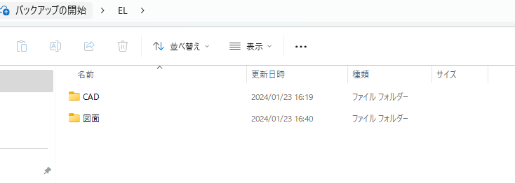
> `図面`フォルダには図面のファイルを
> `CAD`フォルダにCADのファイルを入れていきます。
3. CADフォルダと図面フォルダに名前付けと同じ階層になるようにフォルダを作る。
   例えば名前付けの中には`Frame ASSY`があり、その中には様々な`Stay`類が入っています。
   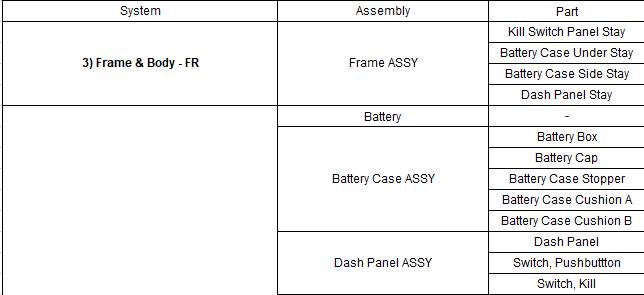
   同じようにCADフォルダの中にも`Frame ASSY`という名前のファイルをつくり、その中に`stay類`を入れていきます。
   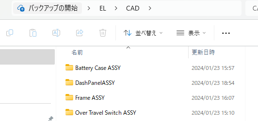
   もちろん、アセンブリになっていないただの部品はフォルダにいちいち入れなくても大丈夫です。

   **まあ、よくわからんかったら2024のコストの各種提出場所の図面のELのやつでも見てみてください。**

#### 作業時の注意点
> [!CAUTION]
> 図面ファイルとCADファイルは作業中も**必ず**同じファイル構造にしてください。

ダメな例 ⛔
CADフォルダ
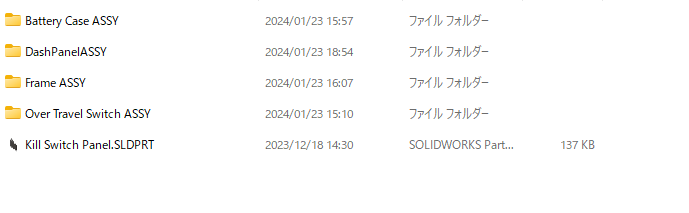
図面フォルダ
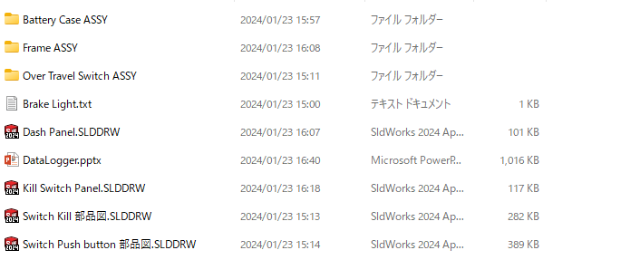

良い例 :blush:
CADフォルダ

図面フォルダ
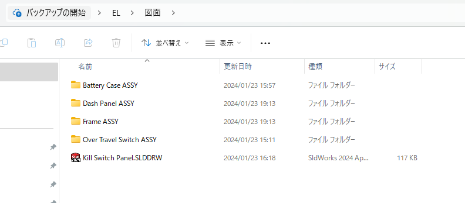

### テンプレファイルの使い方
#### お勧めのやり方 🔰
1. どっかからその年の図面のテンプレファイルを探す。
2. テンプレファイルを作業したいフォルダにコピーしてくる。
3. テンプレファイルを作業するパーツの名前に変える。
4. その図面ファイルを開き、図面を開く。
   
#### 図面書きなれた人向け
##### 図面をかく前の設定(各PC一度のみ)
1. どっかからその年の図面のテンプレファイルを探す。
2. テンプレファイルを開く。
3. `指定保存`をクリック。
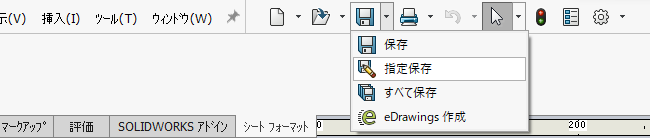 
4. ファイルの種類を`図面テンプレート(*./drwdot)`を選択。
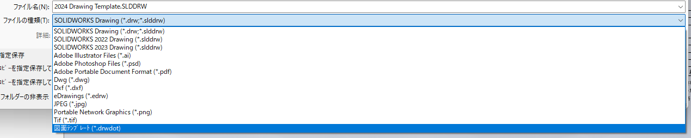
5. そのまま保存ボタンを押して、保存。
   
##### 図面を書く時
1. 普通にSOLIDWORKSを開く。
2. `新規`を開く。
   
3. 設定をしていれば、`2024 drawing template`が出現する。
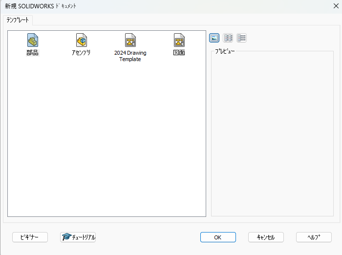

> **こんな画面にならない場合**
> 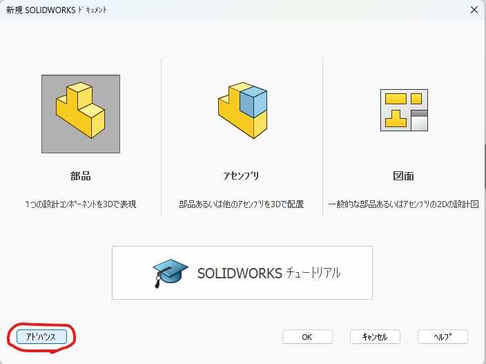
> `アドバンス`を押すと、テンプレートが見れるようになります。
4. テンプレートファイルのやつをクリックして、普通に図面を作る。

## 図面の書き方
**機械科の人に教えてもらえ!**
**資料を見ろ!**
以上

一応、テンプレの図面のファイルの外側にも色々かいてあります。
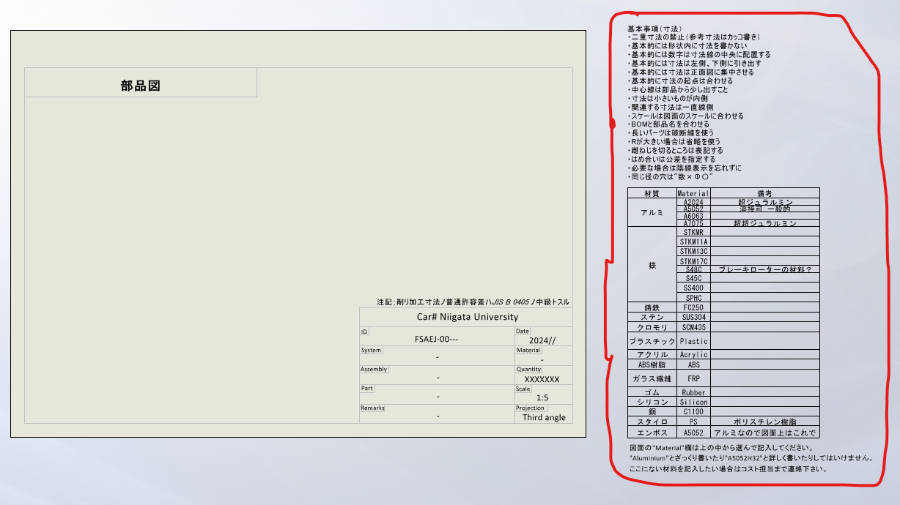

## どの部品を図面にして、どの部品を写真にするか
> [!NOTE]
> 購入した部品=写真
> 自作した部品=図面

ただ、以下の部品は購入しても図面を出します。(何故だかはわからん)
- マスタースイッチ
- キルスイッチ
- オーバートラベルスイッチ
- セルのスイッチ