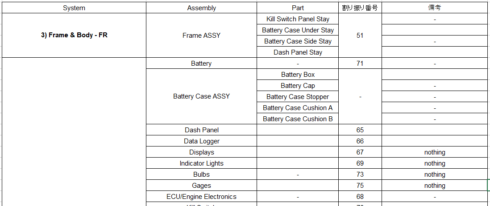

# ここはコストの名前付けのページです。

## 名前付けとは

こんなやつ

## 名前付けのやり方
詳しいやり方はコスト資料にお任せします。

## ざっくりとした補足
基本的には、前年度のファイルをファイルごとコピーしてきて、去年との変更点を修正をコピーしてきたファイルでしていくという感じで進めます。

### systemの分け方
基本的には、ELは`3) Frame & Body - FR`と`4) Electrical – EL`という2つしか使いません。

> [!NOTE]
> - `3) Frame & Body - FR`には、フレームに溶接するステーを入れる。
> - `4) Electrical – EL`には、その他ELで使用する部品を全部入れる。
  
もし、新たにハーネスを保護するために内張りを付けるとか、ハーネスを箱で覆うというようになったとしても、`4) Electrical – EL`に入れましょう。

基本的には、この2つのシステムを使うことはありません。(私の想定内では)

### Assemblyの分け方
#### ステー類
> [!NOTE]
> ステー類は全て、`Frame ASSY`に突っ込みます。

なので、`3) Frame & Body - FR`は`Frame ASSY`以外が入ることはありません。

#### その他
後のパーツをどんどん`4) Electrical – EL`の中に入れましょう。

### partsについて
前年度の名前付けを見ているなら分かると思いますが一応書きます。

例えば、バッテリーケースのCADは
- バッテリーボックス
- バッテリーキャップ
- バッテリークッションA&B
- バッテリーケースストッパー

これらの部品のアセンブリです。
このように複雑な部品を名前付けに書く場合は、CADのアセンブリの名前を**Assembly**に入れて、構成されているパーツを**parts**に入れます。

### CADはアセンブリじゃないけど、アセンブリとして書いた方が良い場合
このような場合もあります。

コストにはファイナルというコストもあります。
> [!NOTE]
> ファイナルとは、全てのパーツを実際にマシンに組み立てる工程を説明しているコストです。

このファイナルをするときに、あまりにAssemblyが細分化されていると、ファイナルをするときに大変になってしまいます。

例えば、ダッシュパネルにはキルスイッチとセルのスイッチが付いていますが、これをファイナルでダッシュパネルに組み付けるのではなく、
ダッシュパネルASSYとしてキルスイッチとセルのスイッチをダッシュパネルに組付けた状態にしておけば、ファイナルではダッシュパネルをフレームに組み付ける工程を説明するだけで済むという話です。

### 備考にnothingと書かれているやつ
> [!WARNING]
> 部品を使っている使っていないに関わらず、必ず書かなければいけない部品があります。

部品を使っていないけど、書かなきゃいけないという部品には`nothing`という備考を書きます。

#### 例
Bulbsという部品が去年の名前付けに書かれていると思います。
実際のマシンにはBulbsなんていう謎のものは乗せていませんが、必ず書かなければいけないので`nothing`と備考に書かれています。

### 備考欄について
#### nothingについて
上記

#### `Included in Main Wire Harness`について
これは、コネクターやヒューズなどWire Harness ASSYの中に部品が含まれていることを示すものです。
ECUなど、Wire Harness ASSYからコネクターとかで外せるやつは、この備考は書きません。