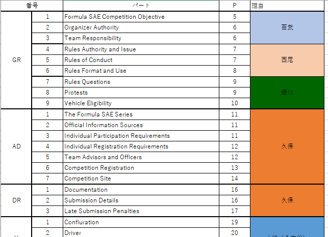
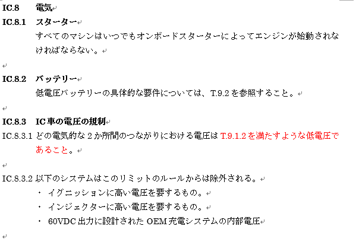
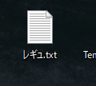
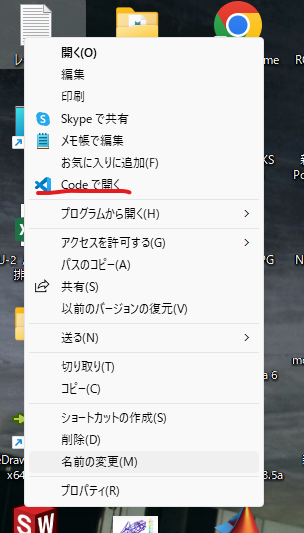
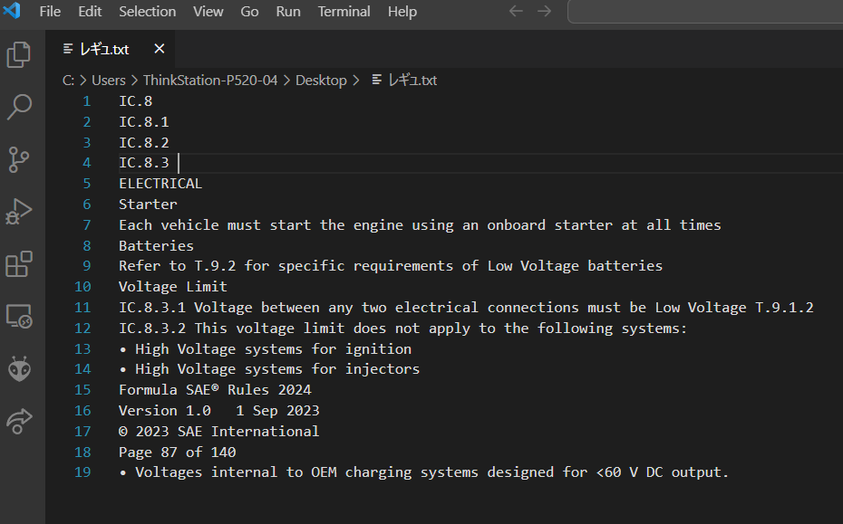
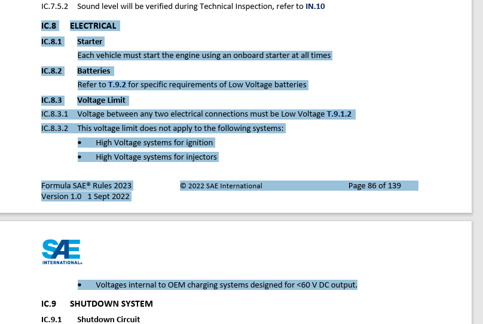
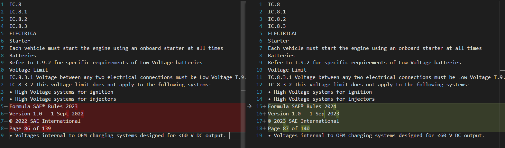

# レギュレーション和訳について

## 手順
### 用意するファイル  
- 今年のレギュレーション  
- 去年のレギュレーション  
- 去年の和訳  

### 1. 自分の担当を確認しよう。
2024年だったら、(Z:\2024\レギュレーション関連)にあるよ。    

### 2. レギュを訳す。
昨年から変更されている箇所は ${\color{red}赤字}$ にしてね。  

## 個人的におすすめならくちんレギュ翻訳。
### 1. デスクトップで適当に`.txt`ファイルを作る。

### 2. txtファイルを右クリックして、`codeで開く`をクリック

**Windows11だったら、右クリック→その他のオプションを確認→codeで開く**
もし`codeで開く`がなかったら、そのパソコンにvisual Studio codeが入っていないのかも。Visual Studio Codeがインストールされている、別のPCでtxtファイルを作ろう。  

### 3. 自分のレギュレーション部分(今年のレギュ)をコピペして、txtファイルに貼る。
今回、私は`IC.8`をコピーしてきました。  

### 4. 3.で貼った箇所と同じ場所の去年のレギュを探し、`ctrl + c`でコピーする。
今回、3で`IC.8`をコピーしてきたので、去年の`IC.8`を探してきます。  

コピーしてくるけど、ペーストはしないでね。  

### 5.vscodeで開いたtxtファイルに戻ったら、`Ctrl + K`を押した後に、`c`を押す。
`Ctrl + K C`というショートカットキーです。  

### 6. クリップボードの内容(去年のレギュ)とテキストファイル(今年のレギュ)の比較ができます。

協調表示されている箇所が、ファイルを比較して変わっている部分です。  
今回は日付とページ番号しか変わってないね。  

### 7. 去年のレギュファイルをコピーしてきて、基本はそのままで、変わっている箇所だけを赤字にして訳す。
去年のレギュファイルで赤字だった部分を黒にする作業も忘れずに。