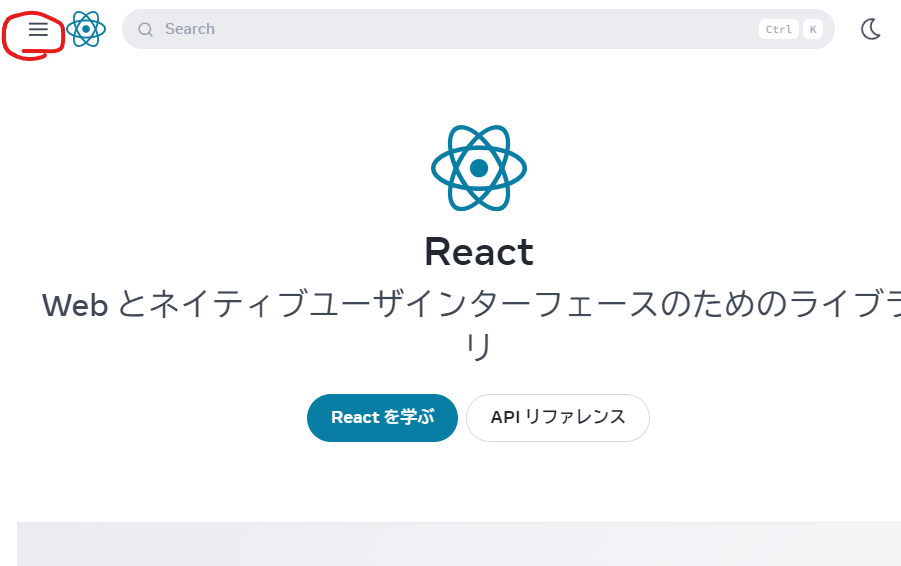
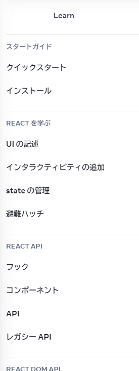

# React編
ついに、react編やってきました。  

## 1. Reactとは
FaceBook社(現:Meta社)が開発したフレームワークです。  
Webページの描画に関わるツールなのですが、割と色んなことができて、
- Webアプリ(Webページ)
- スマホアプリ
- PC用デスクトップアプリ
- VRコンテンツ

など色んなことができます。  
今回は、Webアプリしかやらんけどね。  

## 2. 学習教材について
珍しくちゃんと教材を紹介したいと思います。  
[React公式チュートリアル](https://ja.react.dev/)
結構Reactって使いこなそうと難しいのですが、このドキュメントはかなり分かりやすいです(このドキュメントより分かり易い公式のドキュメントは見たことない)。  

開くとこんな感じです。  
赤丸の部分をクリックすると、ドキュメントの構造が見れます。  
  
- `スタートガイド`
  - `クイックスタート`: 5分で分かるReactみたいな感じ(初見じゃ絶対わからない)
    - `チュートリアル 3目並べ`: 3目並べをReactで作りながら学びます。  
  - `インストール`: 環境構築方法。今回はつかいません。
- `Reactを学ぶ`: 教科書みたいに体系的にReactを学べます。  
  - `UIの記述`: Reactで静的なページを作る方法を学びます。  
  - `インタラクティビィティーの追加`: stateについて学びます。
  - `stateの管理`: stateを使うときの作法を学びます。
  - `避難ハッチ`: useEffectやuseRefについて学びます。
- `React API`
 > 俗に言うAPIドキュメントです。機能から逆引きして学ぶ感じです。　　

## 3. これからの予定
本当は以下のように勉強したいと思っていました。  
`UIの記述`  
↓  
`インタラクティビィティーの追加`  
↓  
`避難ハッチ`  

しかし、量が多すぎて心が折れると思うので、以下のようにします。  
`UIの記述`  
 ↓  
`チュートリアル 3目並べ`  

`インタラクティビィティーの追加`と`避難ハッチ`をじっくり勉強せず、かいつまんで勉強する`チュートリアル 3目並べ`で補おうという作戦です。  
上手くはまるかはわかりません。  
もし、理解できなかったら、`インタラクティビィティーの追加` と`避難ハッチ` で勉強をしてください。

# 本編
## 18~23日目 (Reactで静的なページを作る)
[UIの記述](https://ja.react.dev/learn/describing-the-ui)

## 23~25日目 (ささっとuseState)
[チュートリアル 3目並べ](https://ja.react.dev/learn/tutorial-tic-tac-toe)