# HTMLファイルって結局なあに？
> 厳密な定義よりもザックリとした理解を優先して説明しています。羽田さんとか詳しい人に胸を張って説明すると、ご指導が下るので注意。

2~4日目を終了したあなたは、なんとなあくhtmlの書き方をつかめました。

htmlはこんな感じでタグで囲むんでしたね。
```html
<p>こんにちは</p>
```
pタグとかh1タグとか、いろいろありますね。

じゃあ4日目以降、Webサイトを作ってください課題が続くんですけど、どうしたら良いのでしょうか？🤔
それについて、お話します。

## Webブラウザってなんだろう？

Webブラウザというのは、ChromeとかMicrosoft EdgeとかFirefoxとかSafariとかのことです。
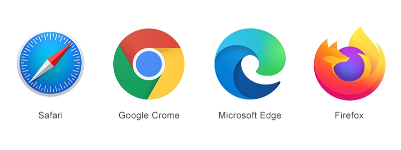

みなさん日常的に使っていると思います。

じゃあPCのブラウザを開いて好きなページを開いてみましょう。
私は、阿部寛のホームページを開きました。
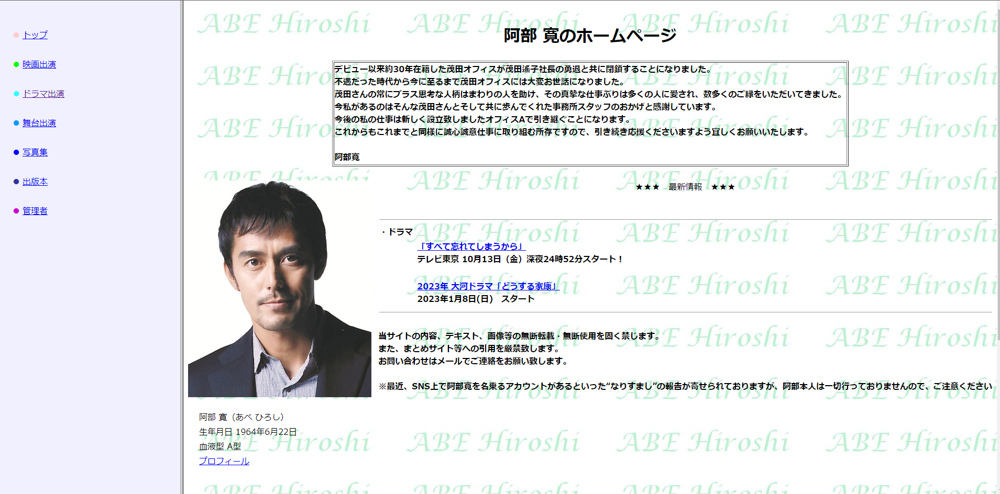

シンプルでいいですね。

では、F12キーを押してみましょう。(Macの場合は、option+command+i)
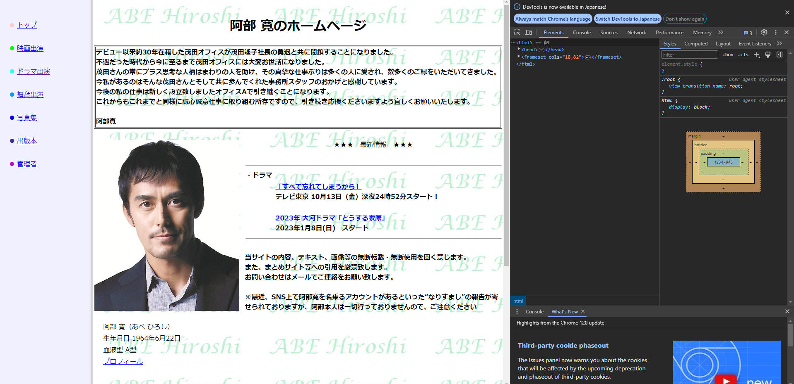

右側にわけわからんものが出てきましたね。
今後こいつと仲良くしてもらうんですけど、それはさておき。

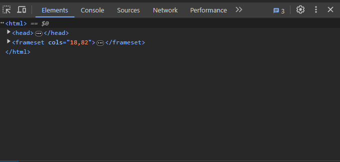
上の写真部分に注目。
なんか見覚えがありません？
全部展開してみましょう。

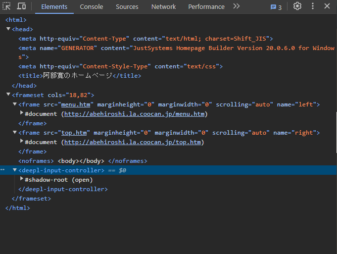
そうです。htmlですね。

ちなみにYouTubeはこんな感じ。
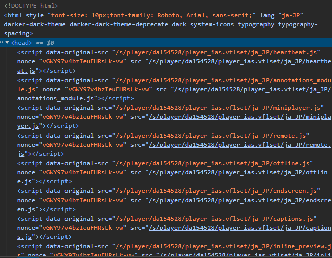

見覚えのないタグだらけかもしんないけど、`<html>`タグとか`<head>`タグとか`<body>`タグとかは見覚えがあると思います。

阿部寛のページのようなシンプルなものから、YouTubeのような複雑なものまで、**すべてhtmlで書かれています。**

なんとなくブラウザって、htmlファイルを読み込めそうな感じがしてきましたね。

### 実験してみよう
#### htmlファイルを作ってみよう。
とりあえず、htmlファイルを作ってみましょう。

まずは、vscodeを導入しましょう。
[vscodeの導入](https://qiita.com/nextfp/items/de702b7f90c581eaee72)

vscodeを導入したら、vscodeを開いてください。
適当な場所でindex.htmlというファイルを作ってください。
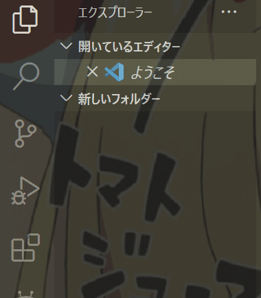

index.htmlというファイルができたら、以下のように書いてください。
```html
<h1>Hello World</h1>
```
htmlファイルは、`<html>`タグで囲まれている必要があります。
`<html>`タグの中には、`<head>`タグと`<body>`タグが必要です。
色んなことを習ったと思いますが、ここではいいんです。
だって、これだけでもhtmlファイルって動くんだもん。

そしたら、ファイルを保存してエクスプローラーからファイルを開きます。
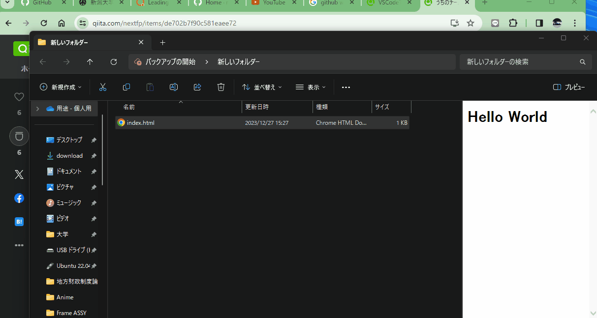

無事に、Hello Worldが表示されましたね。

つまり、ブラウザというのはhtmlファイルを読み込んで、描画するソフトなんですね。

#### 2.htmlファイルを取得してみよう。
どのように、htmlファイルが取得されているのでしょうか？
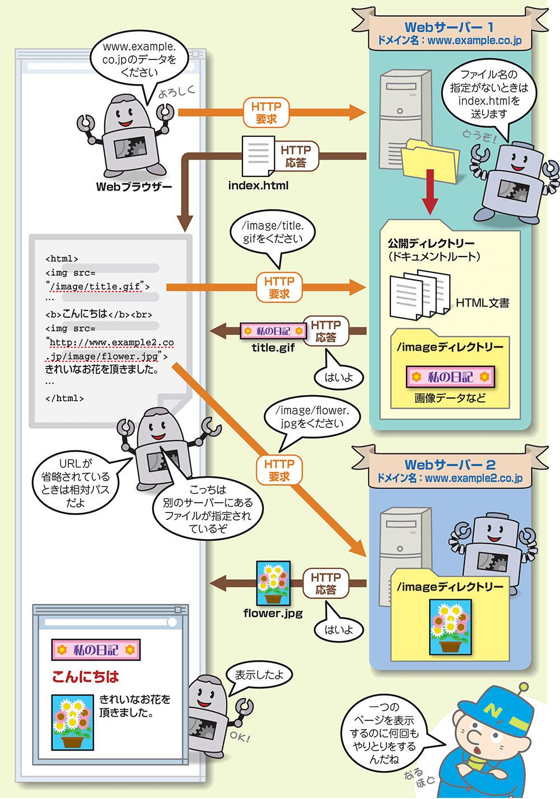

良い拾い画がありました。

こんな感じに、Webブラウザがサーバーにhtmlファイルを要求して、サーバーがhtmlファイルを返しているんですね。

実感がわかないと思うので、やってみましょう。

`curl`というコマンドがあります。(Macできるのかな？)
これをターミナルに打ち込んでみましょう。
vscodeに戻り、`ctrl + j`を打ち込むとターミナルが開きます。
以下のこまんどを入力します。(Windowsの人は、以下のコマンドの前に`cmd`と入力し、Enterを押してください。)
```bash
curl https://www.eng.niigata-u.ac.jp/~ecet/
```
`https://www.eng.niigata-u.ac.jp/~ecet/`というのは工学力教育センターのページです。

すると、以下のような結果が出てきます。
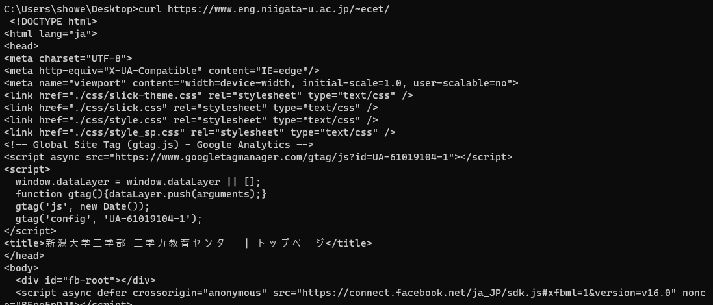

やべえほど、大量も文字が出てきます。
これを頑張って全部コピーして、さっきの`index.html`に貼り付けてみましょう。

先ほど同様に、ファイルを保存してエクスプローラーからファイルを開きます。
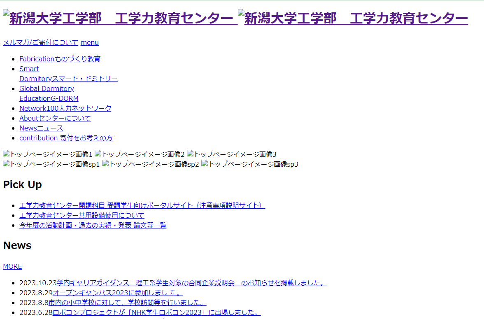
cssが死んでるので、ちょっと見づらいですが、工学力教育センターのページが表示されましたね。

#### 分かったこと
- Webブラウザは、htmlファイルを読み込んで、描画するソフト
- Webブラウザは、サーバーにhtmlファイルを要求して、htmlファイルを取得している

### Webサイトを作るには？
なんとなくWebサイトを作るために必要なものが分かってきましたね。
つまり2つだけです。

- htmlファイル
- htmlファイルを配信するサーバー(現時点ではちょっとむずい)

自分のPC上だけでよいなら、htmlファイルだけで良いです。
というわけで、暫くは**htmlファイルだけでWebサイトを作っていきましょう。**