# pokeAPIで練習するJavaScript

## はじめに
今回は、JavaScriptの基本的な文法のアウトプットとして、PokeAPIというポケモンの情報を取得できるAPIを使用して、**ポケモン図鑑を作ってみましょう。**
最初に、軽く構文を確認してから、実際に演習を行います。  
> [!NOTE]  
> 以下が分からない方でも大丈夫です。  
> - APIとは何か  
> - fetch API  
> - JavaScriptによるDOM操作  
> - ポケモンについて  

ただし、  
> [!WARNING]  
> 以下の前提知識が必要です。  
> - JavaScriptの基本的な文法(if for while 関数)  
> 
> また、この記事はJavaScriptの基本的な文法のアウトプットが目的なので、APIを触るにあたり必要な非同期処理については触れません。  

## 0. javascriptの実行方法  
JavaScriptはブラウザの中で動く言語です。そのため、ブラウザ上で実行できます。面倒くさい環境構築は不要です。  
  
まず普通にhtmlファイルを作成します。  
```html
<script>

</script>
```
htmlファイルの中身は、これだけでよいです。このscriptタグの中にJavaScriptのコードを書いていきます。  
  
とりあえず、Hello Worldでもしましょうか。    
```html
<script>
  console.log("hello world!");
</script>
```
この状態でファイルを保存し、htmlファイルをブラウザで開いてみましょう。  
ブラウザで開いたら、ディベロッパーツールを開いてください。(開き方はググろう)  
いつもは、`Elements`タブを開いていると思いますが、今回は`Console`タブを開いてください。  
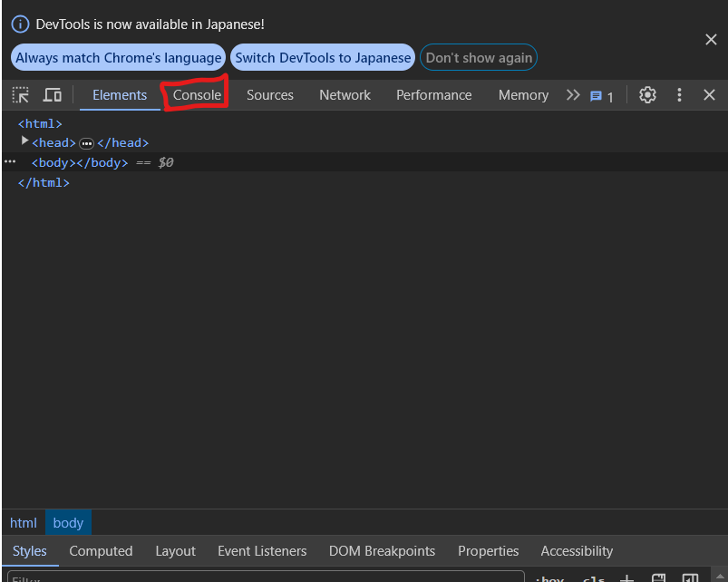  
こんな感じにHello World!が表示されていれば成功です。  
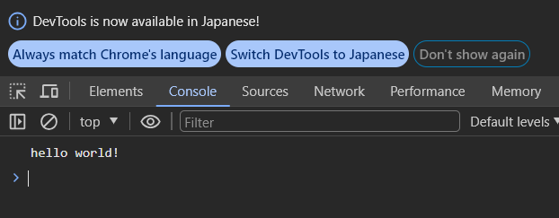

<details>
<summary>文字化けした場合</summary>
文字化けした場合は、htmlファイルの文字コードが設定していないことが原因です。  
htmlファイルの一番上に以下のように書いてください。  
```html
<!DOCTYPE html>
<html lang="ja">
<head>
    <meta charset="UTF-8">
</head>
<body>
    <script>
        console.log("hello world!");
    </script>
</body>
</html>
```
このようにしてください。  
</details>

数値計算もしてみますか。(これ以降は面倒くさいのでScriptタグの中身だけを書きます。)  
```js
console.log("2かける3は", 2 * 3);
```
> [!WARNING]
> 実行結果を更新するには、ブラウザをリロードする必要があります。

ということで、ブラウザを再読み込みしてみましょう。  
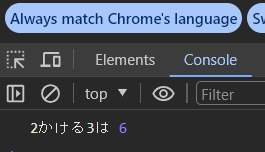

## 1. オブジェクト(辞書型)
### 普通のオブジェクト
オブジェクトについて復習しましょう。  
```js
const pika = {
    name: "ピカチュウ",
    type: "電気",
    lv: 50,
    popular: true,
  };
```
このように、オブジェクトは`{}`で囲み、`key: value`の形でデータを格納します。  
データを取り出すときは、`オブジェクト名.key`で取り出せます。   
```js
const pika = {
    name: "ピカチュウ",
    type: "電気",
    lv: 50,
    popular: true,
  };
console.log(pika.name); // ピカチュウ
```
ブラウザで実行してみましょう。  
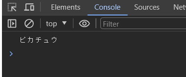

条件式でも使えますよ。  
```js
  const pika = {
    name: "ピカチュウ",
    type: "電気",
    lv: 50,
    popular: true,
  };
  if (pika.type === "電気") {
    console.log(pika.name, "は電気タイプだよ。");
  } else {
    console.log(pika.name, "は電気タイプじゃないよ。");
  }

  if (pika.lv > 10) {
    console.log(pika.name, "はそこそこ強いよ。");
  } else {
    console.log(pika.name, "は雑魚だよ");
  }

  if (pika.popular) {
    console.log(pika.name, "は人気だよ。");
  } else {
    console.log(pika.name, "は不人気だよ。");
  }

```  
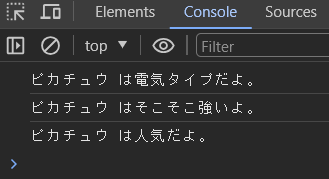

### 配列の中にオブジェクト
配列の中にオブジェクトを入れることもできます。  
```js
  const pokemons = [
    {
      name: "ピカチュウ",
      type: "電気",
      lv: 50,
      popular: true,
    },
    {
      name: "ナエトル",
      type: "草",
      lv: 30,
      popular: false,
    },
    {
      name: "ゼニガメ",
      type: "水",
      lv: 50,
      popular: true,
    },
  ];
  console.log(pokemons);
  console.log(pokemons[0].name); // ピカチュウ
  console.log(pokemons[2].name); // ゼニガメ
  console.log("配列の長さは", pokemons.length);
  for (let i = 0; i <= pokemons.length - 1; i++) {
    console.log(pokemons[i].type);
  }
```  
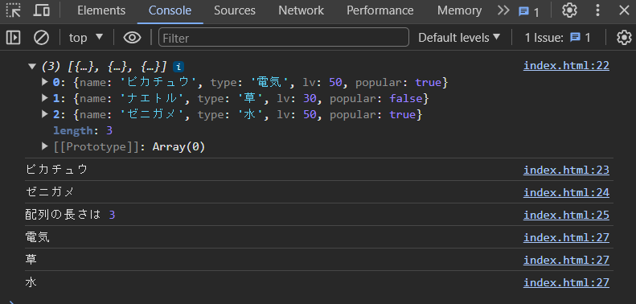

ちなみに、適切にキーを設定しなかった場合や、配列の範囲外を参照した場合は以下のようなエラーや挙動になります。  
```js
  const pokemons = [
    {
      name: "ピカチュウ",
      type: "電気",
      lv: 50,
      popular: true,
    },
    {
      name: "ナエトル",
      type: "草",
      lv: 30,
      popular: false,
    },
    {
      name: "ゼニガメ",
      type: "水",
      lv: 50,
      popular: true,
    },
  ];
  console.log(pokemons[0].weight); // キーが適切でない場合
  console.log(pokemons[4]); // 配列の範囲外の参照
  for (let i = 0; i <= pokemons.length; i++) {
    console.log(pokemons[i].type);
  }
```  
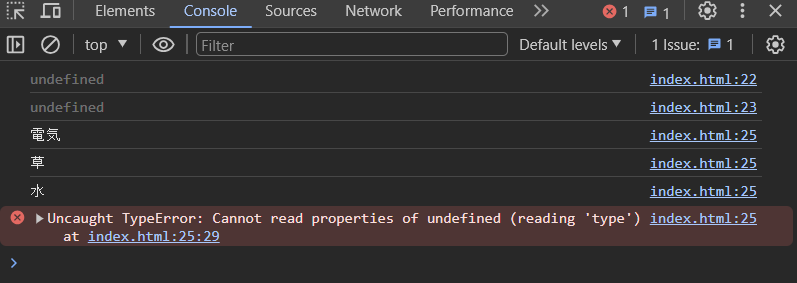

## 2. fetch関数
fetch関数は、webからデータを取得するための関数です。 
使い方が分かるコードを見てみましょう。 
```js
const data = fetch("https://pokeapi.co/api/v2/pokemon/pikachu");
```
このように、fetch関数の引数にURLを渡すと、そのURLからデータを取得できます。  
ちなみに上記のコードの引数として渡しているURLは、ピカチュウの情報を取得できるAPIのURLです。  

ただし、このコードは期待したように動きません。少し手を加えます。  
```js
  async function getData() {
    const data = await fetch(
      "https://pokeapi.co/api/v2/pokemon-species/pikachu"
    );
    console.log(data);
  }
  getData();
```
`async`ってなんだ？`await`ってなんだ？って思ったかもしれませんが、今回はおまじないだと思って気にせずブラウザで実行してみましょう。   
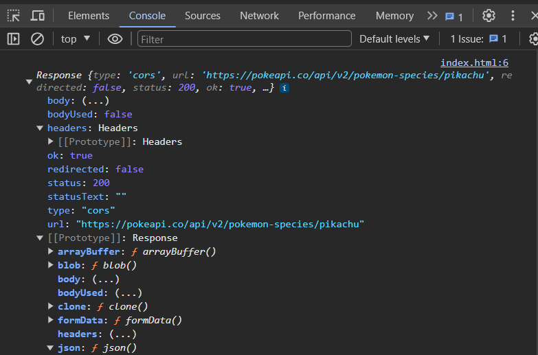

出力できているし、`Response`っていうのが表示されているので、値が帰ってきていそうです。  
さらにひと手間加えます。  
```js
  async function getData() {
    const data = await fetch(
      "https://pokeapi.co/api/v2/pokemon-species/pikachu"
    );
    const parseData = await data.json();
    console.log(parseData);
  }
  getData();
```
先ほど帰ってきた値はよくわかりませんでした。なので、`json`メソッドを使って、JSON形式に変換しています。json形式とは、JavaScript Object Notationの略で、JavaScriptのオブジェクトとよく似た形式のデータです。  
似すぎていて、JavaScriptのオブジェクトと同じ感覚で使えます。  
ブラウザで実行してみましょう。  
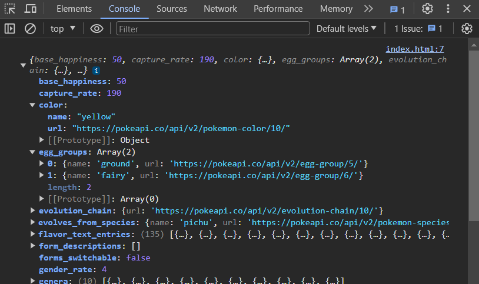  
情報が多すぎて分かりづらいのですが、`yellow`とか`pichou`=ピチューとか書いてあるので、それっぽいデータを取得できていることが分かります。

## 3. DOM操作
DOM≒HTMLです。
JavaScriptでhtmlを操作してみましょう。
ちなみに今回以降あまりガッツリDOM操作はやりません。なのであまり覚えようとしなくても大丈夫です。
```html
<script>
  async function getData() {
    const data = await fetch("https://pokeapi.co/api/v2/pokemon/25");
    const parseData = await data.json();
    document.getElementById("output").innerText = JSON.stringify(parseData);
  }
  getData();
</script>
<p id="output"></p>
```
先ほどはparseDaataはコンソールに出力していましたが、今回は`output`というidを持つpタグに出力しています。
```js
 document.getElementById("output").innerText = JSON.stringify(parseData);
```
ここで、`document.getElementById`は、idを指定してその要素を取得するメソッドです。つまりここで出力先の要素を指定しています。  
そして、`innerText`はその要素の中身を書き換えるメソッドです。 
さらに`parseData`を`JSON.stringify`で文字列型に変換しています。`JSON.stringify`を使わずに直接代入したバージョンも試すと、この処理が必要性が分かるかもしれません。   
ブラウザで実行してみましょう。  
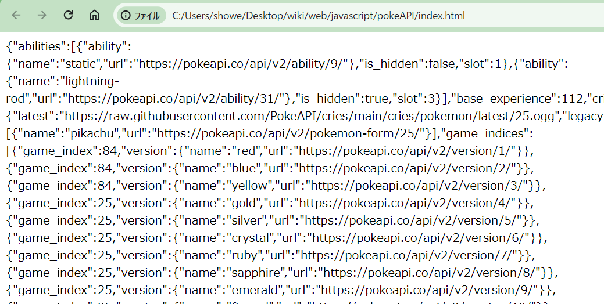
今度はディベロッパーツールではなく、ブラウザの画面に出力されているのが分かります。

## 演習
### やり方
それでは、本題のポケモン図鑑を作ってみましょう。  
ただ、丸投げは酷なので、とりあえずポケモンの図鑑番号を取得するところは一緒にやりましょう。  
とりあえず雛形としてこんな感じのhtmlファイルを作成してください。  
```html
<script>
  async function main() {
    const data1 = await fetch("https://pokeapi.co/api/v2/pokemon/25");
    const parseData1 = await data1.json();
    const data2 = await fetch("https://pokeapi.co/api/v2/pokemon/24");
    const parseData2 = await data2.json();
    console.log(parseData1)
    document.getElementById("pokeId").innerText = JSON.stringify(parseData1);
  }
  main();
</script>
<p id="pokeId"></p>
```
先ほどとほぼ同様なコードです。  
ブラウザで実行すると、以下のようにコンソールに出力されます。  
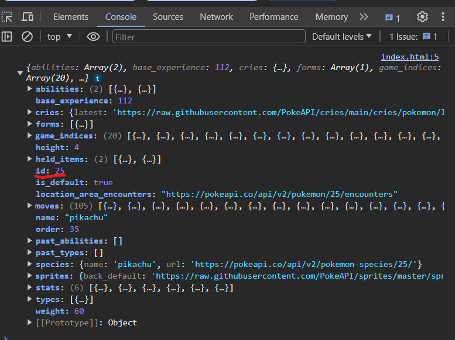  
コンソールの中に出力されているデータの中に、`id`というキーがあります。これがポケモン図鑑番号です。  
ではコードを書き換えて`id`をブラウザに表示させてみましょう。  
以下のように書き換えてください。
```diff
- document.getElementById("pokeId") = JSON.stringify(parseData1);
+ document.getElementById("pokeId") = JSON.stringify(parseData1.id);
```
ブラウザで実行してみましょう。    
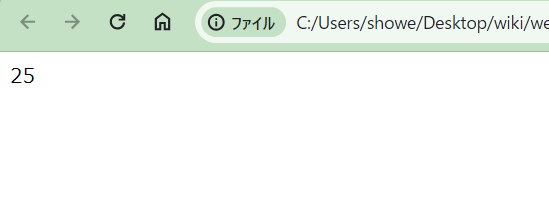

### 問題
なんとなくやり方が分かったところで手を動かしてみましょう。  
完成予想図は以下のような感じです。  
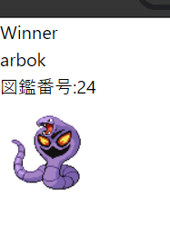

ただし、以下のような仕様にしてください。(ちょっとポケモン図鑑から離れた仕様になるが、ご勘弁を)  
- データを整理する`makeData`関数を作成してください。  
  - `makeData`関数は、引数にAPIから取得し、JSON形式に変換したデータを受け取ります。(つまり`parseData`) 
  -  `makeData`関数は帰り値として、次のようなデータ(例はピカチュウの場合)を返します。
  ```js
  {
    id: 25, // 図鑑番号
    name: "pikachu", // 名前
    img: "https://raw.githubusercontent.com/PokeAPI/sprites/master/sprites/pokemon/25.png", // 画像のURL
    lv: 50, // 1~100の間でランダムな数値でポケモンのレベルを表現
  }
  ```
- `makeData`関数に`parseData1`を渡しその帰り値を受け取る処理。`makeData`に`parseData2`を渡してその返り血を受け取る処理をそれぞれ書いてください。
- `makeData`関数の帰り値には、`id`、`name`、`img`、`lv`が含まれているので、それを使って、ブラウザに表示してください。
- ただし、`parseData1`と`parseData2`のどちらも表示するのではなく、ポケモンのレベルが高い方のみを表示してください。

以上のことを守るとブラウザの再読み込みするたびに、ポケモンが変わるプログラムになるはず。

#### ヒント
- APIのデータの中のほしい情報の場所。
  - 図鑑番号: APIのデータ→id
  - 名前: APIのデータ→name
  - 画像のURL: APIのデータ→sprites→front_default
  - 上の3つの文が何を言っているのか分からなかったら、APIのデータがオブジェクトであることを思い出し、APIのデータをコンソールに出力してみましょう。
- 画像のDOM操作。
  - document.getElementById(画像が入るタグのid).src = 画像のURL;
  
