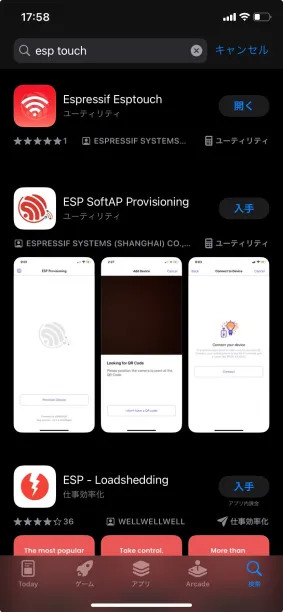
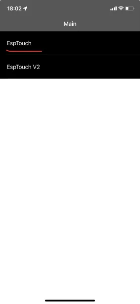
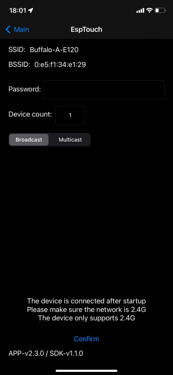
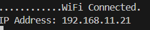
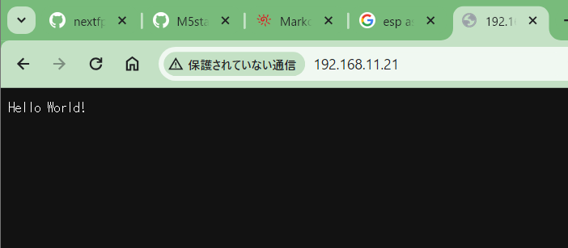
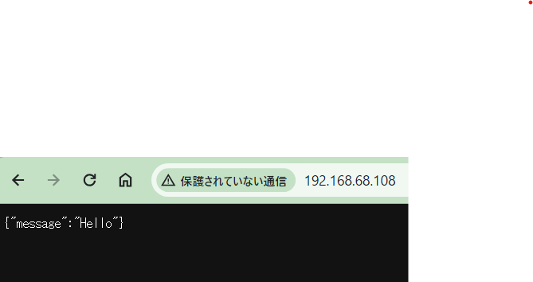
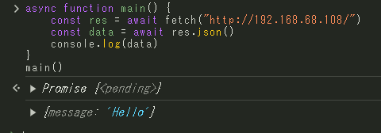
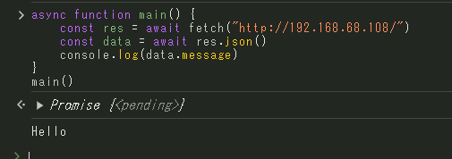
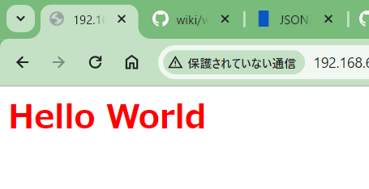
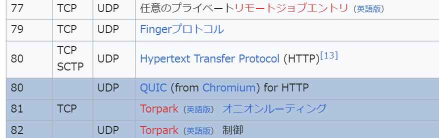

# PokeAPIで練習するJavaScript --補足編--

## はじめに
説明省きすぎてJavaScriptは分かったけど、モヤモヤ感が残る内容になってしまったので、少し伏線回収したいと思います。  
  
ということで、APIを自作するのですが、素のJavaScriptで作るのは無理ゲーなので、勉強したであろうマイコンを使います。  
  
## 用意するもの
- ESP32(M5Stackでも可)  
- Platform IOが使えるPC  
  
## 0. PlatformIOの使いかた
[PlatformIOの使い方はここから思い出してください](https://qiita.com/nextfp/items/f54b216212f08280d4e0)  

## 1. WiFiの接続
WiFiの接続方法は2つあります。  
基本的に1番がセキュリティー的におすすめですが、センターのWiFiだとなぜか1番が使えないので、その場合2番を使いましょう。

### (1). WiFiの接続方法その1 
#### マイコン側の設定
`smart config`という機能を使用します。
次のようなコードを書いてください。
```cpp
#include <Arduino.h>
#include <WiFi.h>

void setup()
{
  // put your setup code here, to run once:

  Serial.begin(115200);
  Serial.println("smart config start!");
  WiFi.begin();
  // WiFiに接続できるまでループ
  while (WiFi.status() != WL_CONNECTED)
  {
    // millis()はマイコンの起動時間を取得できる関数。
    // ESP32は前回の接続情報を記憶し、自動で接続を試みるので、少しループを回して待機。
    // 定期的に"."を出力
    if (millis() % 500 == 0)
    {
      Serial.print(".");
      delay(1);
    }
    if (millis() > 10000) // 　自動接続に失敗したら入る処理
    {
      Serial.println("Smart Config Start!");
      WiFi.beginSmartConfig();
      // スマートコンフィグできるまで待機。
      while (!WiFi.smartConfigDone())
      {
        // 定期的に"."を出力
        if (millis() % 500 == 0)
        {
          Serial.print(".");
          delay(1);
        }
      }
      Serial.println("Smart Config Done!");
    }
  }

  Serial.println("WiFi Connected.");

  // WiFiが接続できた証拠にIPアドレスを表示。
  Serial.print("IP Address: ");
  Serial.println(WiFi.localIP());
}

void loop()
{
  // put your main code here, to run repeatedly:
}
```

コードを書き終わったら、マイコンに書き込んでシリアルモニターを確認しましょう。
> ボーレートを115200に設定するのを忘れずに。

#### スマホ側
Android派の方は読み替えてお進みください。  
App Storeで`ESP touch`と調べて、`Espressif Esptouch`をインストールしてください。  
  
  
EspTouchをタップ。  
  
WiFiのパスワードを入力し、`confirm`をタップし、しばらく待つとESP32がWiFiに接続されます。  


なぜかセンターではつながりません。

### (2). WiFiの接続方法その2
```cpp
#include <Arduino.h>
#include <WiFi.h>

const char *ssid = "WiFiのSSID";
const char *password = "WiFiのパスワード"; 

void setup()
{
  // put your setup code here, to run once:

  Serial.begin(115200);
  Serial.println("smart config start!");
  WiFi.begin();
  // WiFiに接続できるまでループ
  while (WiFi.status() != WL_CONNECTED)
  {
    // 定期的に"."を出力
    if (millis() % 500 == 0)
    {
      Serial.print(".");
      delay(1);
    }
  }

  Serial.println("WiFi Connected.");

  // WiFiが接続できた証拠にIPアドレスを表示。
  Serial.print("IP Address: ");
  Serial.println(WiFi.localIP());
}

void loop()
{
  // put your main code here, to run repeatedly:
}

```

> [!WARNING]
> ssidとパスワードを書き間違えないようにしてね。

実行するとどちらの方法もIPアドレスが表示されます。  


## 2. APIを作成しよう その1
まず、APIを作成するためのライブラリをインストールします。  
platformio.iniに次の文を追記してください。  
```platformio.ini
lib_deps =
    me-no-dev/ESP Async WebServer @ ^1.2.3
```

次に、main.cppをいじります。  
```cpp
#include <Arduino.h>
#include <WiFi.h>
#include "ESPAsyncWebServer.h" // 追記

AsyncWebServer server(80); // ポート番号80でサーバーを立てる。

void setup()
{
  // WiFiの接続設定は省略

  // ルートパス(/)にアクセスがあったら、Hello World!を返す。
  server.on("/", HTTP_GET, [](AsyncWebServerRequest *request)
            { request->send(200, "text/plain", "Hello World!"); });
  server.begin();
}

void loop()
{
  // put your main code here, to run repeatedly:
}
```
WiFiの接続処理など、先ほどのコードは省略したので、今回示した分を前回のコードに追記してください。  
書き込んで、シリアルモニターを確認すると、IPアドレスが表示されます。  
IPアドレスをブラウザに入力すると、Hello World!が表示されます。  


## 3. APIを作成しようその2
次に、APIを作成します。  
といっても、何も難しいことはありません。  
```cpp
server.on("/", HTTP_GET, [](AsyncWebServerRequest *request)
            { request->send(200, "text/plain", "{\"message\":\"Hello\"}"); });
```
`server.on`関数の中身だけを変更してください。  
変更部分は、以下のみです。  
```diff
- "Hello World!"
+ "{\"message\":\"Hello\"}"
```
ブラウザにアクセスすると、先ほどと同じような形式で`{"message":"Hello"}`が表示されます。  
  

それでは、完成したAPIが使えるのかやってみましょう。  
  
javaScriptの実行方法は任せます。ブラウザのディベロッパーツールでも、htmlファイルを作ってもどちらでも構いません。    
```js
async function main() {
    const res = await fetch("http://192.168.68.108/")
    const data = await res.json()
    console.log(data)
}
main()
```
> [!WARNING]
> `"http://192.168.68.108/"`は数字をマイコンのIPアドレスに変更してください。  

実行結果を確認すると、`{message: "Hello"}`が表示されます。  
  
jsonなので、オブジェクトとして扱えます。  
```js
async function main() {
    const res = await fetch("http://192.168.68.108/")
    const data = await res.json()
    console.log(data.message)
}
main()
```


## 4. おまけ
今度はjson以外のデータを返してみましょう。  
```cpp
server.on("/", HTTP_GET, [](AsyncWebServerRequest *request)
            { request->send(200, "text/html", "<h1 style=\"color: red;\">Hello World</h1>"); });
```
ブラウザでアクセスしてみましょう。  

こんな感じでhtmlが表示されます。  
このように、webページもAPIも同じです。  
> [!NOTE]
> htmlページもAPIも同じ :exclamation:  
> 違いはAPIはテキストファイル、htmlはhtmlファイルを返すだけ。  

## 5. まとめ
なんとなくWebのアクセスの仕組みが理解できていたら、うれしい。

## 6. 付録(情報系の授業とった人向け)
### ipアドレスについて
ipアドレスはインターネットの住所です。  
webページもipアドレスで住所を指定するとアクセスできます。  
なので、マイコンのipアドレスを指定すると、マイコンが立ち上げたwebサーバーにアクセスできます。 

### ポート番号について
ポート番号も授業でやったと思います。  
ポート番号は、この部分で指定されています。
```cpp
AsyncWebServer server(80); // ポート番号80でサーバーを立てる。
```
ポート番号80番なのは、http通信(webページやAPIの通信)のデフォルトポート番号だからです。  
(下画像wikiのポート番号の一覧より)  
  

### server.on関数について
`server.on`関数は、リクエストが来たときに、何を返すかを指定する関数です。  
```cpp
server.on("/", HTTP_GET, [](AsyncWebServerRequest *request)
            { request->send(200, "text/plain", "{\"message\":\"Hello\"}"); });
```
引数について説明します。
#### 第一引数 (例: "/")
リクエストのパスを指定します。  
`"/"`ならブラウザで`http://192.168.68.108/`にアクセスしたときに、この関数が実行されます。  
`"/hoge"`ならブラウザで`http://192.168.68.108/hoge/`にアクセスしたときに、この関数が実行されます。  

#### 第二引数 (例: HTTP_GET)
リクエストのメソッドを指定します。  
基本的にはhttp通信が多いので`HTTP_GET`を指定します。  

#### 第三引数 (例: [](AsyncWebServerRequest *request){ request->send(200, "text/plain", "{\"message\":\"Hello\"}"); })
リクエストが来た時に実行する関数を指定します。  
分かりにくいですが、リクエストが来ると、`200`と`"text/plain"`と`"{\"message\":\"Hello\"}"`を返しています。  
- `200`はステータスコードで、成功したことを示します。  
> `404 not found`というの見たことがありますか？これは、ページが見つからなかったことを示していますが、この`404`もページがないことを示すステータスコードです。  
`"text/plain"`はデータの形式を指定しています。`text/html`にすると、htmlファイルを返すことができます。    
`"{\"message\":\"Hello\"}"`はデータです。  
