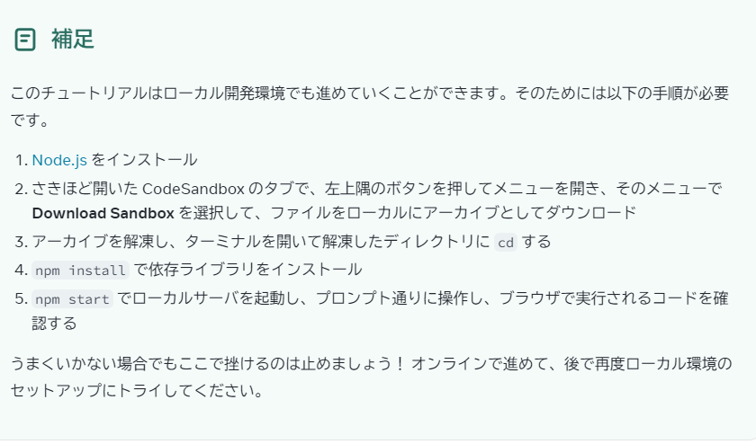
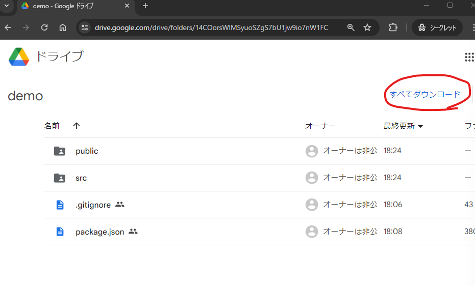
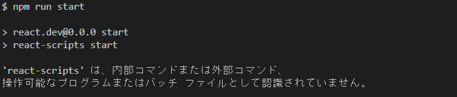
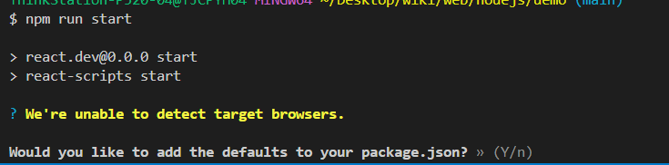

# Node.jsの歩き方のページです。  
## 0. ここでやること
ここは、Reactの前座です。  
Node.jsが何か分からなくてもReactは触ることは可能なのですが、モヤモヤしたり、誤解を生みそうなので先に少しだけ説明します。  

## 1. 今後の目標
[このReactのチュートリアル](https://ja.react.dev/learn/tutorial-tic-tac-toe)のページが理解できるようになるのが、当面の目標。  
ただ、いきなりやっても正味訳が分からないまま終わってしまいそうなので、先に外堀を埋めてから[このReactのチュートリアル](https://ja.react.dev/learn/tutorial-tic-tac-toe)をやって、React卒業みたいな感じです。  

## 2. 前提条件として
普通の一般的なJavaScriptはブラウザでしか動きません。  
なので、JavaScriptでアニメーションを付ける以外には使い道がありません。  

## 3. Node.jsの登場
しかし、Node.jsというものを利用すると、Webブラウザ以外の様々環境(スマホ、Windows、Mac、サーバー、ESP32)などで動きます。    
分かりやすく言うと、CやPythonと同じような感覚で使えるNode.js語というものがあり、Node.js語はJavaScriptと同じ言葉(イギリス英語とアメリカ英語)みたいな感じです。  

## 4. 本日の目標
[先ほど示したReactのチュートリアル](https://ja.react.dev/learn/tutorial-tic-tac-toe)は、オンラインで開発します。パソコンに何かをインストールするという作業をしなくても、大丈夫ということです。  
しかし、今日はNode.jsとは何かを簡単に掴むために、実際にパソコン上に開発環境を用意してみましょう。   
 

## 5. 本編
### 1. Node.jsのインストール
[Windowsの方はこちら](https://prog-8.com/docs/nodejs-env-win)  
[Macの方はこちら](https://prog-8.com/docs/nodejs-env)  
センターで作業する方は、センターの大体のPCにNode.jsは入っているので、この作業は必要ありません。  

### 2. コードの入手
[こちら](https://codesandbox.io/p/sandbox/react-dev-q2z497?file=%2Fsrc%2FApp.js&utm_medium=sandpack)からreactのチュートリアルで作成する制作物のコードが閲覧できます。
> このwikiのdemoというフォルダの中にも同じファイルが入っています。  
  
コードをダウンロードするには、[リンク](https://drive.google.com/drive/folders/14COorsWlMSyuoSZgS7bU1jw9io7nW1FC?usp=drive_link)を開き、  
 
赤丸のところをクリックすると、コードが入手できます。  
zipファイルになってたら、解凍してください。  

### 3. 動かす(1回目)
Reactのプロジェクトを動かしてみましょう。  
入手したコードのフォルダでvscodeを開き、そこでターミナルを開きます。`(ctrl + j)`  
そこで、
```bash
npm run start
```
というコマンドを打って実行します。  

このようなエラーが出ます。  
なぜでしょうか。

### 4. npmについて
このプログラムのフォルダ構造についてお話します。しかし、2度とこのファイル構造のプロジェクトは出てこないので、覚えなくて構いません。    
- public
  - index.html: Webサーバーが立ち上がった時に返されるファイル
- src
  - App.js: Reactで書かれたゲーム部分のソースコード
  - index.js: htmlファイルに読み込まれるReactのファイルが書かれている。
  - style.css: cssファイル
- package.json: 後ほど説明
- .gitignore: 今日は割愛

このような感じになっています。  
実はこのプログラムはWebサーバーを立ち上がるのですが、上に示したファイルにはWebサーバーを立ち上げるようなファイルはありません。  
ということは、ファイル(パッケージ?モジュール?DLC?)が足りていないということです。  
足りていないファイルをインストールしましょう。  
足りていないファイルはコマンド一発でインストールできます。
```bash
npm install
```  
`WARN`とか色々出てきますが、`Error`みたいなのが出なければ大丈夫だと思います。  
コマンドの処理が実行し終わったら、次のコマンドを打ってみましょう。  
`npm run start`  
  
`Would you like to add the defaults to your package.json?`という文が出てきたら、ターミナル上で`Y`と入力しましょう。  
しばらくすると、自動でブラウザが立ち上がり、3目並べが遊べます。  
### 5. 補足
先ほど足りないファイルをコマンドでインストールしましたが、実は足りないファイルは`package.json`の`dependencies`に書かれています。
```json
{
  "name": "react.dev",
  "version": "0.0.0",
  "main": "/src/index.js",
  "scripts": {
    "start": "react-scripts start",
    "build": "react-scripts build",
    "test": "react-scripts test --env=jsdom",
    "eject": "react-scripts eject"
  },
  "dependencies": {
    "react": "^18.0.0",
    "react-dom": "^18.0.0",
    "react-scripts": "^5.0.0"
  }
}
```
この足りないファイルはインターネット上に公開されているファイルを持ってきているのですが、追加でインターネット上からファイルを持ってきたいと思ったら、以下のコマンドを打ちます。
```bash
npm install パッケージ名
```

### 6. おまけ
Node.jsに慣れた後にこのページ見ると色々スッキリすると思います。  
[Node.jsとJavaScriptの歴史](https://qiita.com/neras_1215/items/485f6c752a3b7abb034f)