# 過去に使われていたものなどの資料

## パンパンに入ったジップロック
- シャットダウンリレー導入以前に過電流で燃えたコネクター  
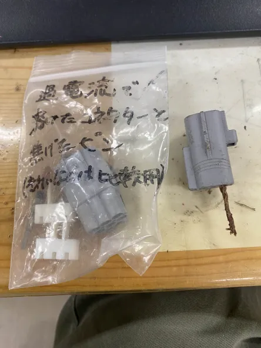  

- シャットダウンリレー導入以前に燃えたコネクター周辺で使われていた配線の一部
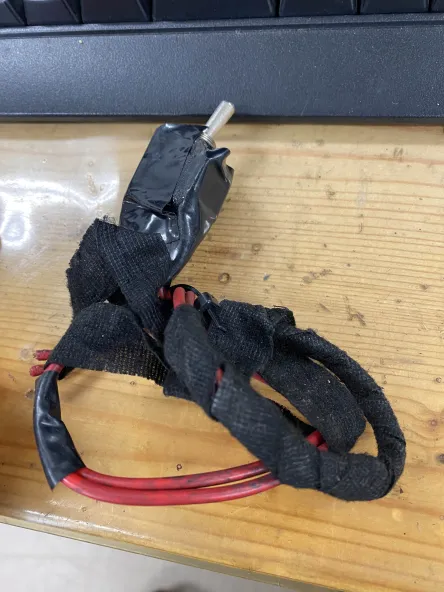  

- 昔坂本先生にグチグチ言われていた？燃料ポンプの配線  
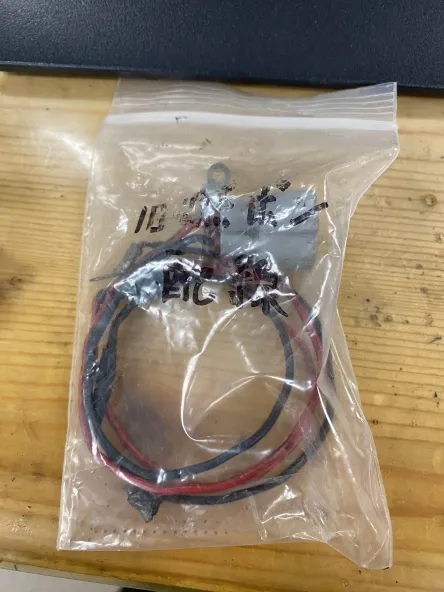  

- 昔のポンプとファンの配線  
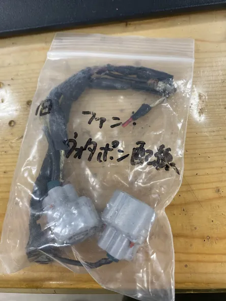

- 昔油圧式のブレーキスイッチだった頃に故障したブレーキスイッチ
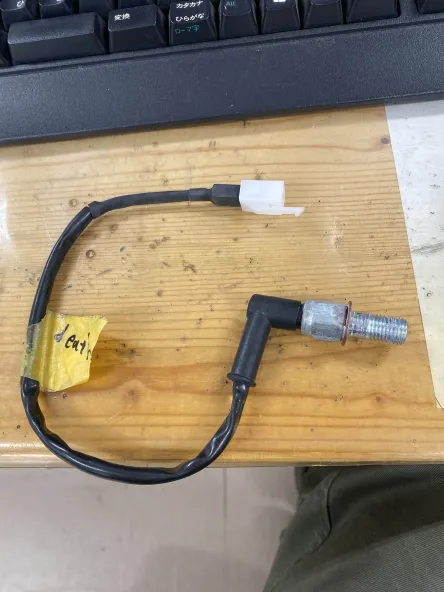

- 度々問題が起こるは、外しにくいはで使うのをやめたスタータースイッチ
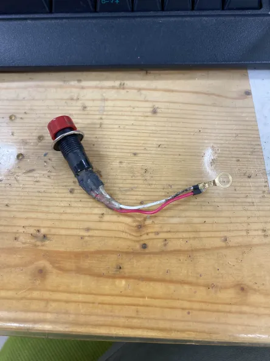

- 切れた80Aヒューズ  
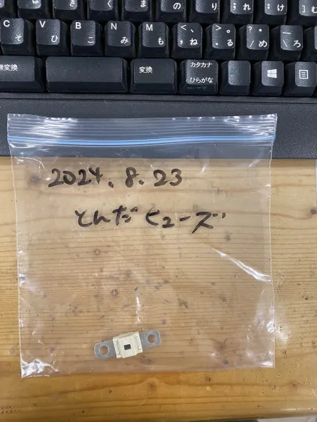

- R600のスピードセンサー  
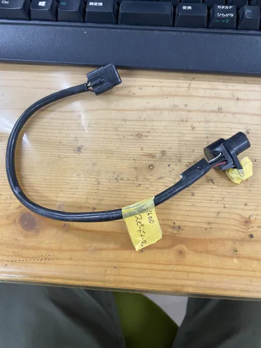

## その他
- 昔のバッテリーケース  
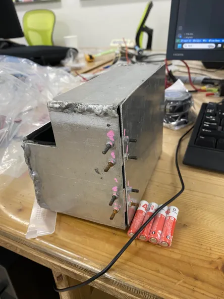

- レギュレーターレクチファイア

- スーパーナット(バッテリー充電器の箱)と台湾YUASAのバッテリーの箱

- R600のインジケーター

- 壊れたシャットダウンリレー

- バッテリーチェッカーとバッテリー充電器の説明書

- 謎のインジ  
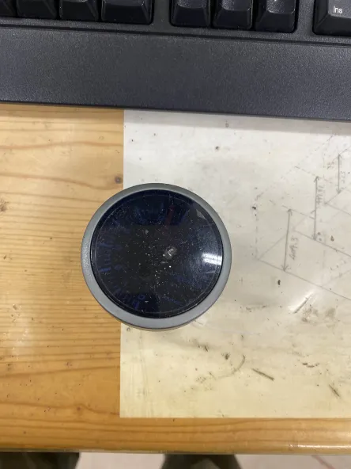

- 壊れた油圧センサー分解したやつ  
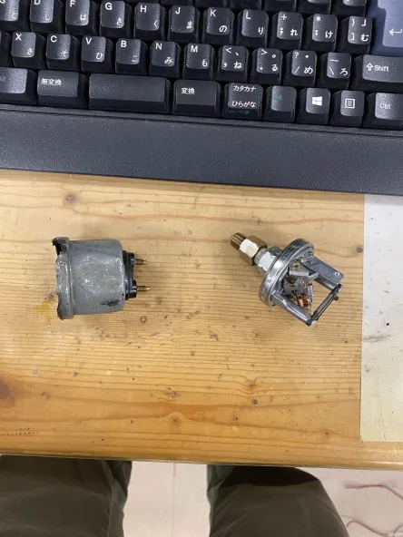

- TAKEGAWAタコメーターのケーブルとステー
- いつぞやのインジケーター