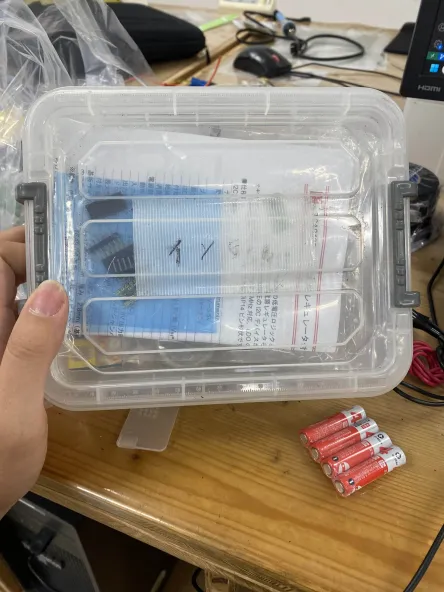
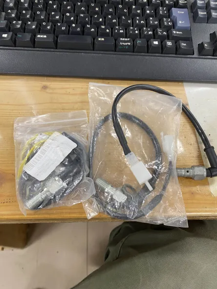
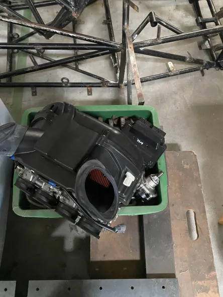
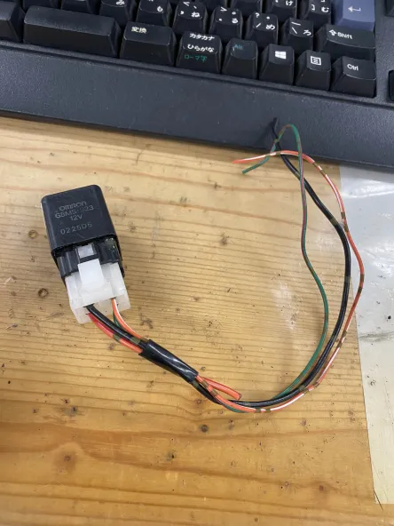
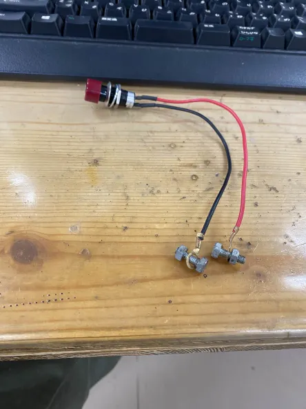
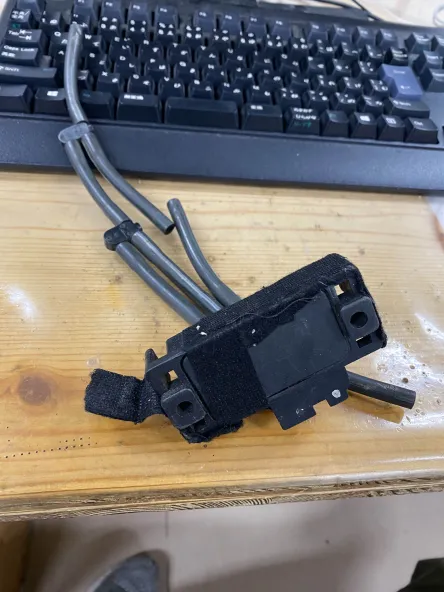
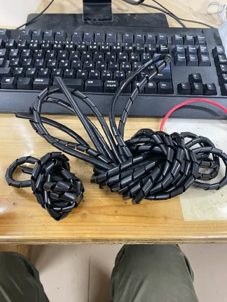
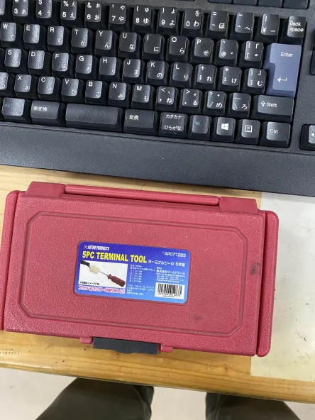
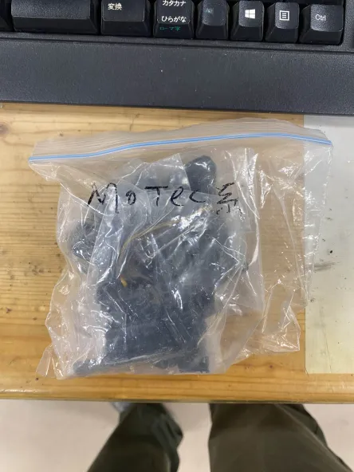

# 使う予定や予備部品パーツ

## インジケーター類(レジ袋内)
- インジケーター部品？過去資料多い  

- インジケーター端子、コネクター類

## 小さいジップロック
- ブレーキスイッチ(油圧式)  

## 歯車研
- カナダ産GSX8SのECU

## その他
- リレー  

- セルのスイッチの予備  

- 吸気圧力センサー  

- コルゲートチューブ  

- コネクターからピンを取り出すやつ  

- MoTeC系の部品(ピンについては別の端子がいっぱい入った箱にある)

- セルモーターリレー

- スイッチ・ピン、ヒューズ、端子
- 熱収縮チューブ

- 配線