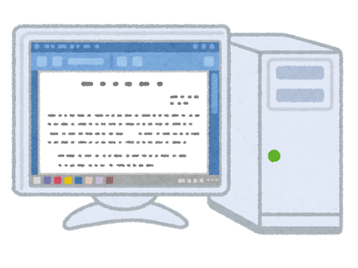
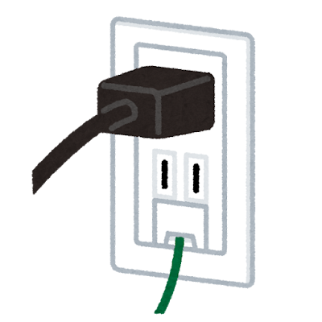
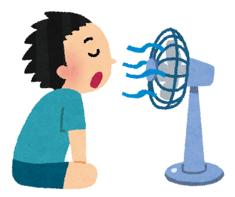
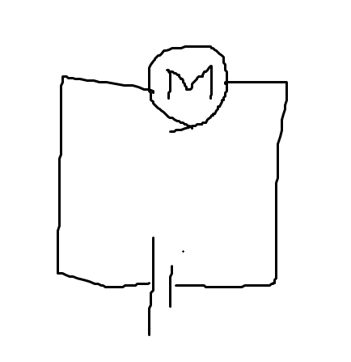
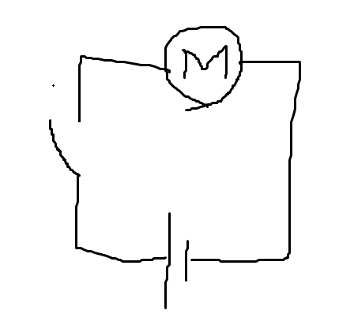
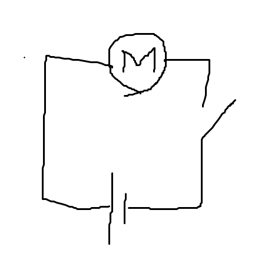

# 4種類の線の話

## 前置き
これから回路図を読めるようになる要素を勉強していく訳なんですが、普通にやると覚える要素が多い!!!。  
ポンプハーネスには、＋の線が何本で～って覚えていくと、多分いつかパンクします。  
なので、電装の仕組みから理解していくことで、覚えることを減らそうというのが育成資料のテーマです。  

## 1. 電源線とグラウンド
まず、4種類の線のうち、2種類の線を一気に紹介します。  
`電源線`と`グラウンド`です。  
理科の実験でもやりましたね、`+`から`-`に電流が流れるというあれです。`+`の線が`電源線`で、`-`が`グラウンド`です。  
では、なぜ`＋の線`とは言わずに、`電源線`と言うのでしょうか？  

### デスクトップパソコンをイメージしよう。
  
PCをイメージしてください、ノートPCではなく、デスクトップパソコンの方をイメージするのがおすすめです。  
デスクトップパソコンには、電源を繋ぎますね。もちろんここには、`＋の線`と`ーの線`があります。(交流だとか面倒くさいことは気にしない)。  
では、デスクトップパソコンなので、パソコン本体にはモニターがありません。どこからかモニターを持ってきて、そのモニターとデスクトップパソコンをディスプライケーブルとかで繋いで使う訳です。このケーブルも電気的なケーブルなので、`＋の線`とか`-の線`があるはずです。  
また、モニターも電源が要ります。このモニターの電源線にも`＋の線`と`ーの線`があります。  
それなら、「そっかあ、既にディスプレイケーブルに`+の線`と`－の線`がある。だから、モニターの電源ケーブル`+の線`と`-の線`は要らない。つまり、モニターの電源は要らないな」とはならない訳です。  

### 線によって役割が違うね。
なぜ、「ディスプレイケーブルを差してても、電源ケーブルが必要」なのでしょうか？  
これは、`ディスプレイケーブルは映像信号を送る役割`であり、`電源ケーブルはモニターやPCを動かす電源を送る役割`という2つの違う役割を持っているわけです。このように、同じ`+の線`と`-の線`でも役割が違うと全然意味が変わってきます。  
なので、わざわざ電源線と呼んでいます。  

### 電源線解説
もう少し`電源線`に対する解像度を上げましょう。  
うちのチームでは、
> [!NOTE]
> `電源線`=**部品を動かすのに必要な電源を運ぶ線**

です。  
  
基本的にどんな部品でも、動くにはエネルギーが必要です。なので、どんな部品でも電源線が必要です。と、言いたいところですが、たまに要らない奴がいます。ですが、今回は例外は後回しにして

> [!NOTE]
> 全ての部品には`電源線`が繋がっている

ということで覚えちゃいましょう。  

### グラウンド解説
> [!NOTE]
> `グラウンド`=0Vの箇所です。

`電源線`が`＋の線`なら対局となる`－の線`がいるはずです。これが`グラウンド`です。ただ、全ての電源線に対する`-の線`がグラウンドという訳ではありません。  
何だかむずそうと思ったかもしれませんが、グラウンドは実は考えることが少ないです。  
というのも、電源線とかその他の線というのは気を使います。どこをどのように通すというのが大事だからです。一方、グラウンドはどうかというと、バッテリーのマイナス(0V)は、マシンのフレームに繋がっています。  
これを`フレームアース`と言います。大事なので、覚えましょう。  
つまり、つまり、マシンのフレームは全てグラウンドとなります。グラウンドをどのように通すか迷ったらテキトーにフレームに繋げてしまえば良い訳です。「どこを通らせるのに迷ってしまったら、フレームにつなげちゃえ」ができる気楽な線がグラウンドです。    
  

## 2. 信号線
4種類の線のうち3種類目は`信号線`です。`センサー線`とも言っちゃいます。  

> [!NOTE]
> `信号線`はセンサーが読み取った情報を送る線です。

つまり、センサーに繋がっている線は大体`信号線`です。電源線とかグラウンドが刺さってることはあるけどね。  
では、センサーはどこに情報を送っているのでしょうか？`MoTeC`とか`データロガー(マイコン)`ですね。つまり、ここらへんとセンサーを繋ぐ線は`信号線`です。

## 3. 制御線
最後に`制御線`です。  
電装初級でやった内容を思い出しましょう。`MoTeC`は何をやっている部品でしたか？そう、MoTeCはエンジンのコントロールをする部品でした。つまり、

> [!NOTE]
> `MoTeC`がエンジンをコントロールするときに使用する線を`制御線`と言います。

エンジンのコントロール以外にもMoTeCの仕事はあり、そこでも制御線が使われています。また、MoTeC以外の制御線もあります。しかし、ここら辺は今回は覚えなくて、大丈夫です。  

### 制御ってなんだよという話
では、具体的に **「どうやって制御しているか」** について考えてみましょう。  
では今回は扇風機の風を制御することを考えてみましょう。  
  
扇風機についている機能と言えば、当たり前ですが電源ボタンを押すと羽が回り、電源をオフにすると羽が止まる機能がまずあります。次に、風量(風の強さ)を変える機能があります。これらの制御をどのようにしたらよいかを題材に制御線について考えてみます。  
超絶簡単に回路図を書いてみました。ここから羽のオンオフと風の強さを変える機能をこの回路につけることを考えましょう。  
  
では、まず羽のオンオフです。これは簡単です。どこかにスイッチを付けて電流を止めてしまえばいいんです。  
  
こうすれば、羽は止まります。  

では、風の強弱をする機能をつけましょう。流れる電流を変えなきゃいけないのですが、パッと思いつくでしょうか？実はこれ結構難しいです。  
そんな難しいこと、たかが新潟大学の学生フォーミュラがやっているでしょうか？答えはNoです。新潟大学の学生フォーミュラをあまり舐めない方がいいですよ。  
しかも、`MoTeC`君も指定した電流を流す機能はありません。`MoTeC`君30万もする癖に意外と無能なのです。  
さて、話を戻しましょう。何がいいたいかというとやってる制御はオンオフをする機能だけなんです。  
つまり、MoTeC君がスイッチを押したり、スイッチになったりと、そういう仕組みになっているだけです。  
まとめると、
> [!NOTE]
> MoTeCが狙ったタイミングで電流を流したり、電流を止めたりする線が`制御`。
> これをやっている線が`制御線`。

### 制御線も2種類あるよ。
ちなみに、電源の止め方は2通りあります。  
＋の線にスイッチを付けて、電源を封じる方法  
  
-の線にスイッチを付けて、グラウンドを封じる方法  
  
制御線も`+の線`と`－の線`があります。ここら辺の兼ね合いで、`電源線であり、制御線である線`や`グラウンドでもあり、制御線である線`が出てきます。ややこしいですね。  
ややこしいところは今回は忘れて、今後確認していきましょう。  

## 4. 配線は色分けされている話
実際に電装ハーネスをくみ上げたあと、「断線しとるやん」となることは往々にして起こります。  
このとき、その断線した線が`電源線`なのか`グラウンド`なのか、はたまた`信号線`なのかということが分からないと困る訳です。間違えて修理して、`電源線`と`信号線`を繋げてしまい、センサーに大電流が流れて壊れるということがあるかもしれません。  
そのため、配線は色付けしてあります。  
なので、色分けを覚えましょう。

> [!WARNING]
> 配線の色分け  
> `電源線`は赤  
> `グラウンド`は黒    

`信号線`と`制御線`は色分けはありません。というのも、この2つは厳密に分けるのが難しいというのもあったり、先輩がさぼってきたというのもあります。  
ただし、明確な色分けはないですが、一本の線は同じ色で繋がるようにされています。配線修理のときには、`グラウンド`に赤色を使ったり、一本の線を繋げるとき(カシメたり、コネクターをまたぐとき)も同じ色の線で繋ぐようにしましょう。  