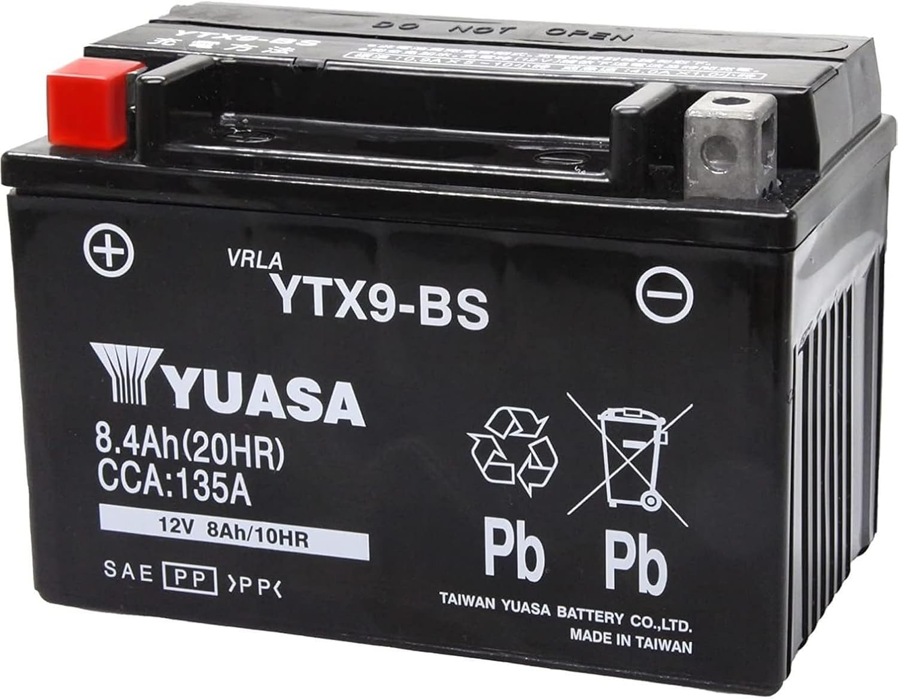

## バッテリーについて

電装担当以外も触ることの多いバッテリーについてですね。  

### 1.バッテリーの種類について

#### 1.1 `鉛蓄電池`
現在、うちのマシンが使っているバッテリーですね。  
私が大っ嫌いな化学の話をこれからします。高校時代にやったような反応式が使われています。  
$$ Pb + PbO_2 + 2H_2SO_4 → 2PbSO_4 + 2H_2O $$
見たくもないですね。  
化学反応式で見てほしかったのは、$Pb$と$H_2SO_4$です。  
$Pb$というの鉛です。鉛は知ってると思いますが、非常に思い金属として有名で、釣りのおもりは鉛ですね。  
そんな金属が使われてるだけあって、
> [!NOTE]
> `鉛蓄電池`も重いという性質を持っています。

$H_2SO_4$というのは、硫酸です。  
私も詳しいことは忘れましたが、硫酸は色んな金属を溶かし、人体へも悪影響をもたらします。ということで、大変危ない電池というわけですね。それでも、他の電池がもっと危ないので、車検員さんにも褒められるのですが。  
硫酸を使うので、漏れたら危険です。普通は密閉されているので、漏れることはないのですが、
> [!WARNING]
> `普通の鉛蓄電池`は傾けて設置することは禁止されています。

説明書に書いてあるので、車検員から突っ込まれる可能性が高いので傾けて置くのはやめましょう。
とはいえ、傾けて置きたくなるケースあると思います。その場合は、`ゲルバッテリー`を使いましょう。横置きや斜め置きをしても大丈夫らしいです。(その分若干高いらしい)  
  
また、静かな環境でバッテリーを充電すると「じゅるじゅるじゅる」みたいな音が聞こえます。これは、化学よく分からないのですが、水素が発生しているらしいです。(反応式にないんだが)。その水素うまいこと循環させているとか、させずに外に漏らしているとかそんな情報を見たので、バッテリーを充電させているときの火の取り扱いには気を付けましょう。とはいえ、今の4年生はバッテリー充電させている直上でグラインダーを使いまくっていました。

#### 1.2 `リチウムイオン電池`
正式には、リン酸鉄リチウム（LiFePO4）バッテリーと言います。  
`リチウムイオン電池`というとモバイルバッテリーとかスマホのバッテリーというイメージがありますね。飛行機に乗るとき、モバイルバッテリーやスマホなどのバッテリーを持ち込むときは、預り荷物ではなく、持ち込まなければなりません。荷室で自然発火すると困るからですね。こんな感じに`リチウムイオン電池`って危ない電池です。NU-17?16?ぐらいまで使われていた電池ですが、車検員に「なにかあったら。永久追放」と言われたのでやめたらしいです。  
`リチウムイオン電池`の特徴ですが、

- 軽い
- 小さい

と言ったメリットがあります。  
なので鉛蓄電池よりも小さいバッテリーが多いイメージです(容量は同じくらいです)。  

### 2. 現在の電池について

今使っている電池は台湾ユアサの`YTX9-BS`を使っています。純正のバッテリーと同じものです。  
同じユアサでも台湾ユアサとユアサがあり、台湾ユアサの方が少し品質が落ちる(寿命が短い)のですが、めっちゃ安いのでこっちを使っています。  
バッテリーの性能ですが、写真に書いてある情報から実はわかります。  
まず電池の容量ですが、8.4Ah(20HR)と書いてありますが、8.4Aを20時間流せるという意味です。  
ちなみに、バイクのバッテリーにはランプの点灯用のバッテリー(6V)とスターターも使えるバッテリー(12V)の二つがあります。両者のバッテリーの違いは、中に入っているセルの数らしいです。セル一つ2Vで、6Vはセルが3つ、12Vはセルが6つです。  
また、CCA:135Aというのは、このバッテリーは135A最大で流れるという意味です。  

### 3. バッテリーのメンテナンス
バッテリーですが、寿命があります。  
バイク用のバッテリーの場合、多くは3年ほどで寿命になります。  
さらに、

> [!CAUTION]
> 空充電のまま放置すると、充電が早まります。

また、放置していると勝手に放電されてしまいます。  

> [!WARNING]
> 月に一度、バッテリーを満充電しましょう。

  

このようにバッテリーの側面にカレンダー的なのがあります。月に一回バッテリーを充電したら、該当する月の箇所にマッキーで印をつけましょう。サボると坂本先生に怒られます。
> 2023の11から2024の2までサボってごめん。🙇

また、バッテリーの残容量(寿命ではなく)は`バッテリーチェッカー`で分かります。バッテリーの寿命に関しては多分坂本先生に頼むと喜んで図ってくれると思います。不安になったらやってもらいましょう。坂本先生はバッテリーとかガジェット系の話好きだからね。  

また、バッテリーの電極部のネジですが、バイク屋さんで買えるらしいです。通販でも買えます。バイク屋の方が安いけどね。無くした場合でも買えるので安心してください。  