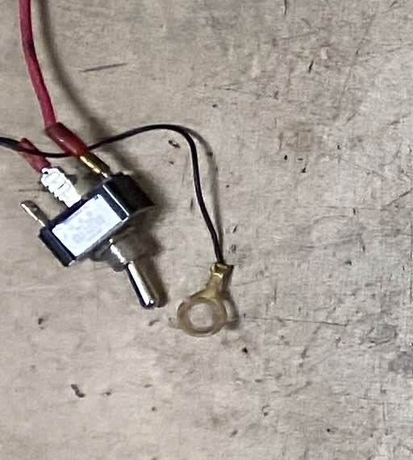

# オーバートラベルスイッチ
## 見た目
  
飛行機のコックピットとかに埋め込まれていそうなスイッチの形です。

## 役割

### 場所
ブレーキの裏です。  
ただし、これはレギュレーションで指定されているわけではありません。  

### キルスイッチとマスタースイッチとの違い
キルスイッチとマスタースイッチ同様にマシンの電源を落とすのが目的です。  
ただし、キルスイッチは緊急時以外には使用されません。

### 緊急時とはどんなとき？
緊急時とはずばり、ブレーキフルードが漏れているときです。  
ブレーキフルードとは、ブレーキに使われている油？のことです。 　
  
詳しいことはブレーキ担当の人に聞いてほしいのですが、ブレーキフルードを入れると、ブレーキの可動域(ブレーキバーが動く範囲)を全部使い切るというのは基本的に無理になります。なぜかって、そりゃ人間が踏むくらいじゃビクともしないような固さになるからね。  
でも、ブレーキフルードが抜けると、ブレーキバーを最後まで踏み抜けてしまうことがあります。こんな時は、マシンはブレーキの力だけでは止められません。  
そんなときに、ギアが入った状態でエンジンを止めるとどうなるでしょう。
エンジンブレーキの状態になり、マシンは止まります。このエンジンを止める=電源を落とすというのをやるのが、オーバートラベルスイッチです。  

## レギュレーションを見てみよう
### T.3.3.1
> The vehicle must have a Brake Over Travel Switch (BOTS). Brake pedal travel exceeding the normal range will actuate the switch

ブレーキの可動域を超えたときにスイッチが作動する必要があります。

### T.3.3.2
> The BOTS must be a mechanical single pole, single throw (commonly known as a two position) switch (push-pull or flip type).

スイッチは、プッシュプル式かフリップ式である必要があります。

### T.3.3.3
> Operation of the BOTS to the OFF position must Open the Shutdown Circuit IC.9.2.2 / EV.7.2.2

スイッチをオフにすると、シャットダウン回路が開く必要があります。
シャットダウン回路については、今回は触れません。  

### T.3.3.4
> Repeated operation of the switch must not reset or restore power  

スイッチを何度も操作しても、電源が復帰しないようにする必要があります。  
現在のシステムでは、ペダルを踏みぬいてからペダルを緩めても電源は復帰しません。

### T.3.3.5
> The driver must not be able to reset the BOTS.  

ドライバーがスイッチをリセットできないようにする必要があります。

### T.3.3.6
> The BOTS must be implemented with analog components, and not using programmable logic controllers, engine control units, or similar functioning digital controllers.  

スイッチはアナログコンポーネントで実装する必要があり、プログラマブルロジックコントローラ、エンジン制御ユニット、または同様の機能を持つデジタルコントローラを使用してはいけません。

これらのことから現在のシステムになっている理由が分かったでしょうか。  

## 設計段階の注意
このパーツはブレーキ担当と蜜に相談して取り付け方を決める必要があります。  
また、コストの図面もどっちが出すかとか、そういうのがあるので、ブレーキ担当と蜜に連絡を取るように心掛けてください。  
