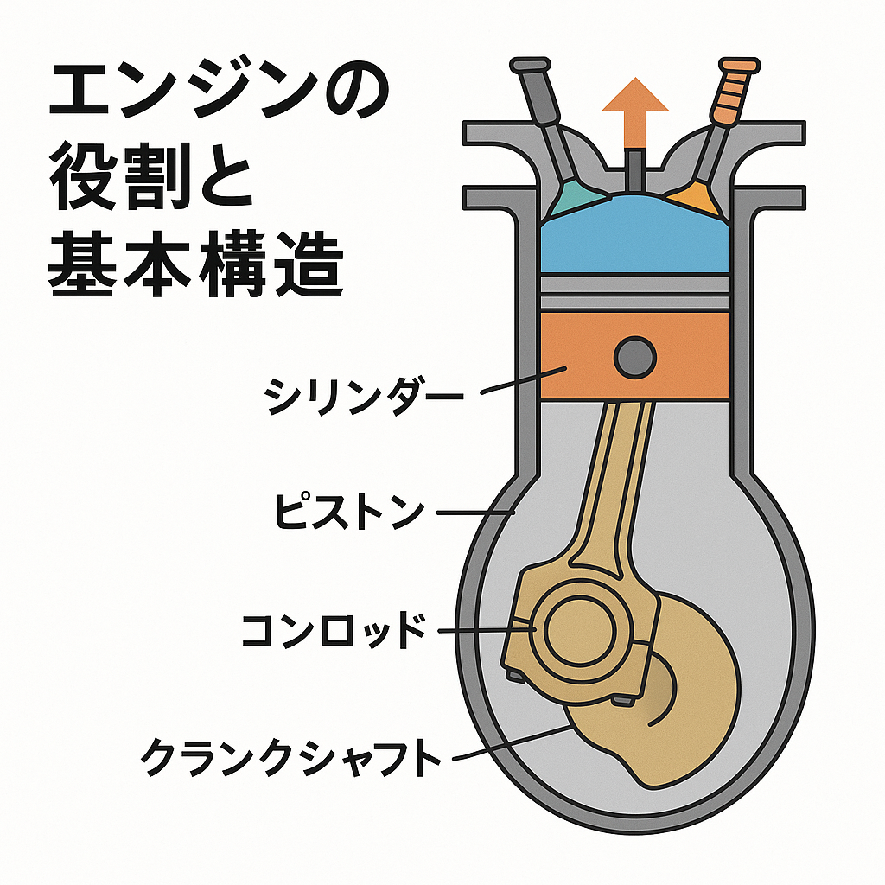
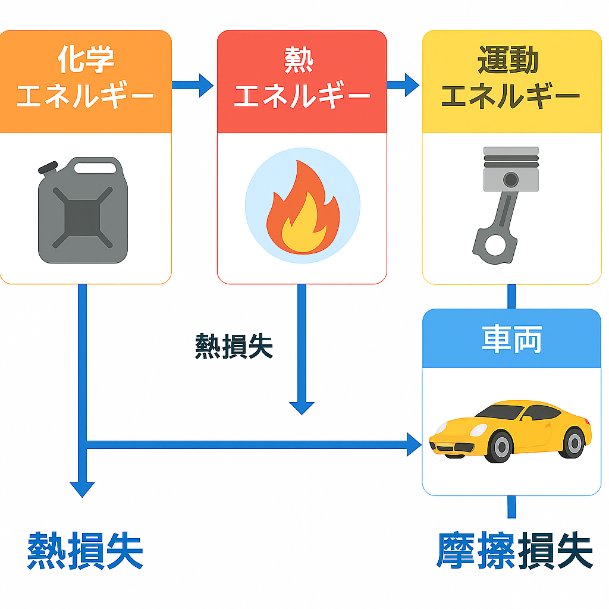
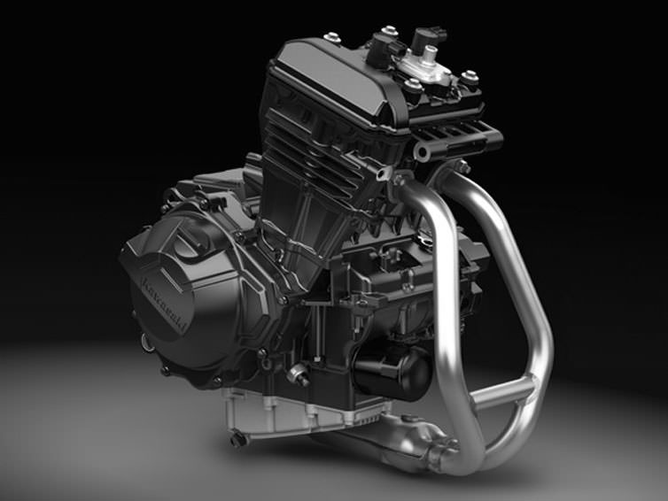
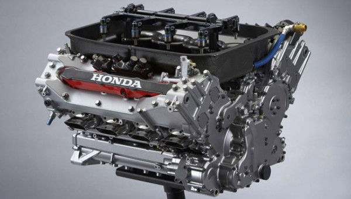

## エンジンについて
まずは車の心臓部**エンジン**について勉強していきましょう。
前提として、これからいろいろなことを勉強すると思いますが、横文字がたくさん出てくると思います。最初から知らないのは当たり前です。かく言う執筆している私も知らないことばかりです。資料は基本的に**あえて横文字のまま**で進めていきます。わからないことは随時調べてわからないことを放置せずにこれから活動していきましょう。自分で調べるとわからなかったことだけでなく、その周辺知識も調べる中で知ることができます。これから知らないこと、初めて聞いたことが多く出てくると思いますが、めげずに頑張ってください！ここで頑張るとこれからが楽になるはずです！（僕はサボったので苦しみました笑）

### 1. エンジンの役割と基本構造

     

エンジンは、燃料の化学エネルギーを機械的な運動エネルギーに変換し、車両を動かす役割を持っています。基本構造は、シリンダー（筒）、ピストン（往復運動する部品）、コンロッド（連結棒）、クランクシャフト（回転運動に変換する軸）が中心で構成されています。さらに吸気系、燃料系、点火系、排気系、冷却系、潤滑系といった補機システムが組み合わさり、安定して燃焼を繰り返しながら出力を生み出しています。二輪や四輪では、並列型やV型、水平対向型といったレイアウトがあり、それぞれ特性が異なります。  

|並列2気筒|V型8気筒|水平対向|
|:---:|:---:|:---:|
||||

### 2. エンジンの動作サイクル

前章ではエンジンの役割と基本構造について触れました。  
この章では、エンジンの動作サイクルについて勉強していきます。  
エンジンサイクルにも様々ありますが、自動車やバイクの代表的なのだと「**4ストロークエンジン**」があげられます。他にも「**2ストロークエンジン**」、「**ローダリーエンジン**」などがありますが、この章では我々のチームのエンジンでもあり、最も一般的な「**4ストロークエンジン**」について解説していきます。

 

    

4ストロークエンジンとは4つの工程で動作するエンジンです。

>**1. 吸気行程**: ピストンが下がり、混合気（空気と燃料）がシリンダーに吸い込まれる。
>**2. 圧縮行程**: ピストンが上がり、混合気を高圧縮する。
>**3. 燃焼・膨張行程**: プラグで着火し、爆発でピストンを押し下げる。
>**4. 排気行程**: ピストンが上がって燃焼ガスを排出する。

これにより、燃料の化学エネルギーを効率的に機械エネルギーへ変換し、車両を駆動させます。

4サイクルの特徴として、吸気・圧縮・燃焼・排気の4つの工程を1回転ごとに順番に繰り返すため、安定したトルクを発生できるメリットがあります。2サイクルエンジンに比べ燃費が良く排ガスもきれいですが、構造が複雑で部品点数が増えるという特徴もあります。フォーミュラで多く採用されるのはこの4サイクル方式で、リストリクタで吸気量を制限しながら最適なパワーを引き出します。

### 3. 各サブシステムの役割
#### 吸気系

#### 燃料系

#### 点火系

#### 排気系

#### 冷却系

