# 放電図面の書き方

## 放電加工ってどんな加工？

wikipediaによると、

> 放電加工（ほうでんかこう、electrical discharge machining、EDM）は、電極と被加工物との間に短い周期で繰り返されるアーク放電によって被加工物表面の一部を除去する機械加工の方法であり、主として、従来の機械加工技術では加工できなかった硬い金属に適用される。  
> ワイヤ放電加工は、金属（大抵、真鍮）の細いワイヤを被加工物に近付けるように送ってゆく。ワイヤはボビンから一定の速さで供給され、上下のガイドで保持される。（まれに左右に保持する機械も存在するが）一対のガイドが相対的に運動することによりテーパ加工、上下任意形状の加工を行うことができる。

らしい。私も詳しいことは分かりません。  

分かってほしいのが、  
  

このようにワイヤーを板の中に入れて、切っていくということです。  

## 放電加工ではできない加工

- 3面で完結しないもの。  
> ワイヤーを斜めにして、切ることはできないよ。  
- 超精度がいるやつ。  
> 0.2mmくらいはずれる可能性ある。

## 放電加工ですべき加工

- 厚い板を切り抜く加工(円形以外)。  
> 円形はフライスでできるよ。  
- ラクソーよりは、精度のいる加工。  

## 図面を作り方
べつに放電だからといって、特別な作り方はありません。  
普通に、他の図面と同じように図面を書きましょう。  
ただ、いくつか注意点があります。  

## 放電の図面を書く際の注意点

### 1. 加工をする際に穴あけが必要です。  

例えば、以下の図のような加工をします。  
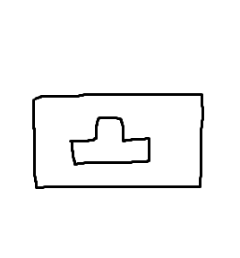  

長方形の母材からテトリミノを切り出す加工ですね。  
では、このような図面を放電担当に依頼すると、どうなるでしょうか？  
たぶん殴られると思います。  
なぜかというと、穴がないからですね。  
思い出してください。放電加工はワイヤーを通します。その出発点となる、最初にワイヤーを入れる場所が必要です。  

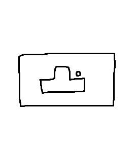

> [!NOTE]
> 加工したい軌跡の側に、6mm以上の穴をあけましょう。  

### 2. 掴みしろを確保しましょう。
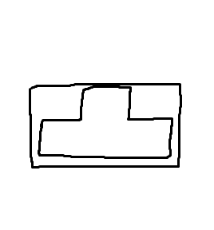  
お次はこんな図面です。  
この図面もNGです。
穴がないというツッコミはすいません。それ以外がダメな要素があります。  
理由は掴みしろがないからですね。  
放電加工は、NCフライスとは違って、母材を台に置くのではなく、空中で母材を掴んで加工します。   
> 上下にワイヤーの通るアームがくるからね。
なので、掴みしろが必要となります。  

> [!NOTE]
> 2辺に最低20mm以上、できれば30mm以上の掴みしろを用意しましょう。  

図面を修正しました。  
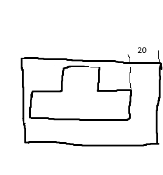  
これもダメです。  

20mmの掴みしろというのは、爪の皮一枚くらいアームで掴める掴みしろです。  
なので、これだと掴めません。  

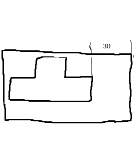  

これはどうでしょうか。70点くらいです。  
理由は2辺で掴んでいないからです。一辺だけだとやはり安定しません。  
これくらい短い母材だったら、全然合格ですが、長い母材だとモーメントがかかるので、加工中に動く危険性があるので、2辺用意しましょう。  

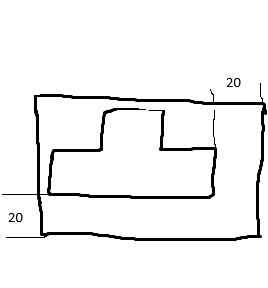  
これもよろしくないです。  
先ほど言った通り、20mmというのは爪の皮一枚くらい乗る程度です。  
なので、2辺掴んだところでだめです。  
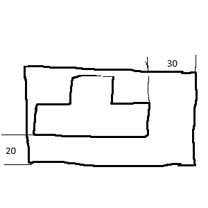  

ありがとう。素晴らしい図面です。

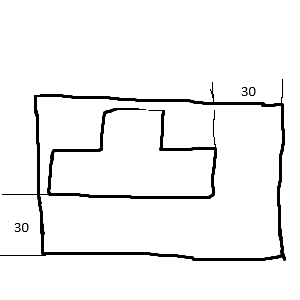  
放電加工担当が泣いて喜びます。

### 3. 寸法を入れよう
寸法を入れましょう。  
たくさんあると嬉しいです。  
ですが、これだけは入れてほしいという点を紹介します。  

> [!NOTE]
> 1. 掴みしろの寸法  
>   
> 2. 穴位置寸法  
> 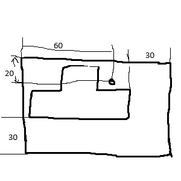
> 3. 外寸  
> 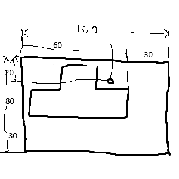

### 4. (合格点だけど、、)面を接触させない
合格点(60点は取れる)けど、良くないよっていう話です。  
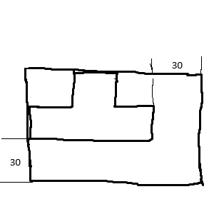  
このように、加工面と母材の端面が一致する図面はよくありません。  

理由は、加工精度が落ちるからです。  
母材の端面が実は出ていなかった場合、この図面だと精度が出ません。  
また、放電は先ほど言った通り、僅かに0.2mmくらい誤差が出ます。 
というときにこれだと精度が出ません。  

### 4. (端面が出ていない母材のとき)フライスで穴を空けよう
端面が出ていないときは、フライスで穴を空けましょう。  
電装は母材の端面から計算して加工を始める点を決めます。 
つまり、端面が出ていないときには加工を始める点が計算できません。  
しかし、

> [!NOTE]
> フライスで穴を空けると端面が出ていなくても加工できます。

放電にはきれいな穴のとき(ボール盤で穴を開けていないとき)に穴の中心を加工を始める点にできるという機能があります。  
ちなみに、端面が出ているときでも、フライスで穴をあけていただけると助かります。  
> 放電で端面から加工位置を計算するのは時間がかかるため。

## まとめ
君はたった数円の母材台を節約するためorひと手間を省いて、加工の遅れを買う？  
あと、春休みの加工期間がきっかけで、人間関係が悪くなったりするよ(例:今の4年生)。