# dxfの出し方

## 放電で必要なもの
- 加工図面
- dxfの出し方

dxf図面は加工図面から作ります。  

> [!NOTE]
> 加工図面の作り方は[ここ](../draw/)にあります。

## dxfの出し方

### 1.新規作成する
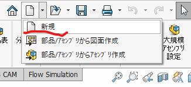

### 2. 図面を選択
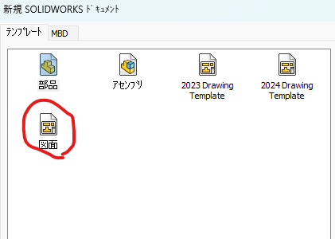

### 3. キャンセルを押す
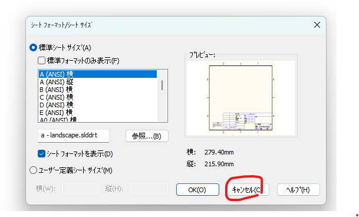

### 4. ものを置く
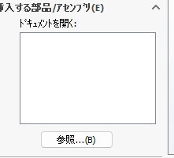  
図面を作るときと一緒

### 5. 図面の比率が1:1になっていることを確認する。
画面端の表示から確認、編集ができる。
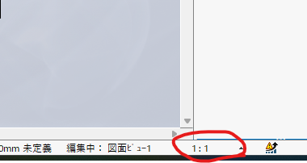　　

### 2. 上のバーの保存の横の▽から指定保存を選ぶ
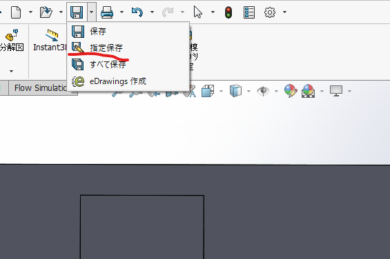  

### 3. ファイルの種類を変える
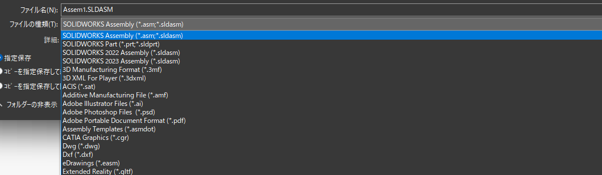  
ファイルの種類をクリック。  
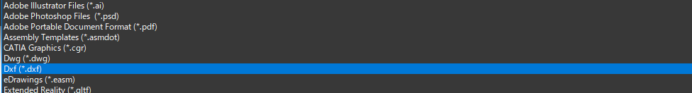  
DXFを選択。  

### 4. 保存する。
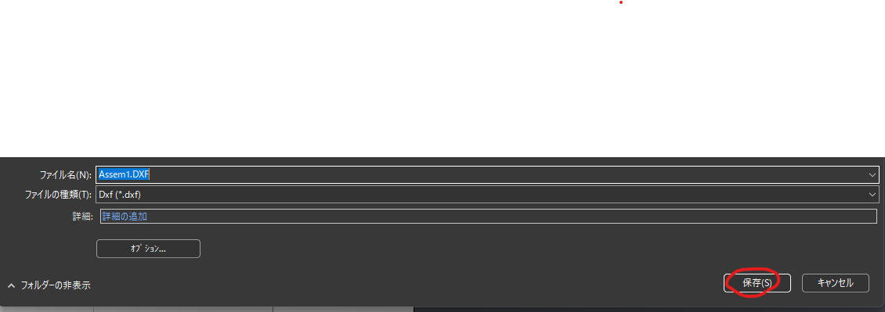

### 5. Done!

## dxfの出し方 ~別のやり方~

### 1. 加工図面で作ったアセンブリを開く
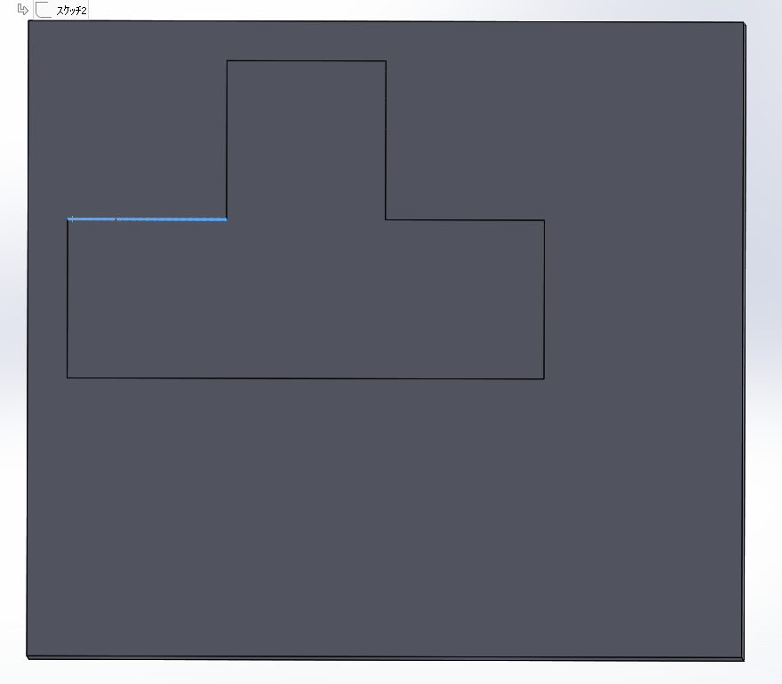  

### 2. 上のバーの保存の横の▽から指定保存を選ぶ
  

### 3. ファイルの種類を変える
  
ファイルの種類をクリック。  
  
DXFを選択。  

### 4. 保存する。

### 5. 出力する面を選ぶ
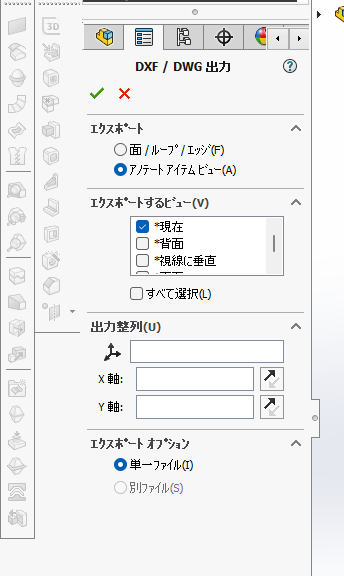  

### 6. 赤のところで選択し、チェックを押す
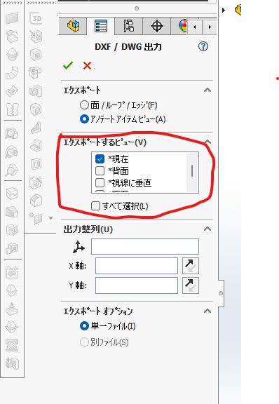

### 7. Done!

