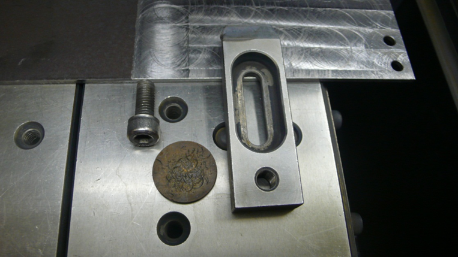
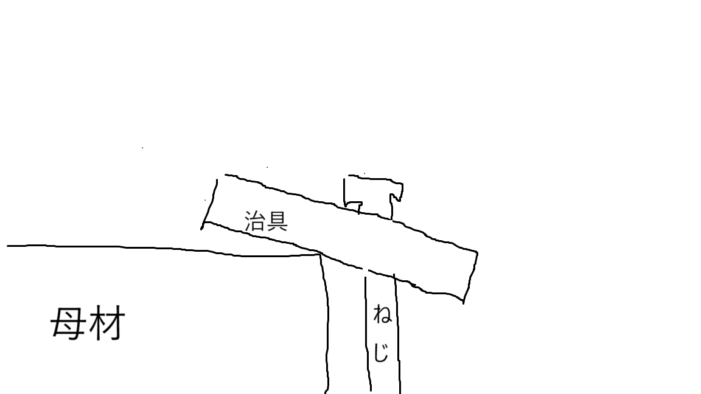
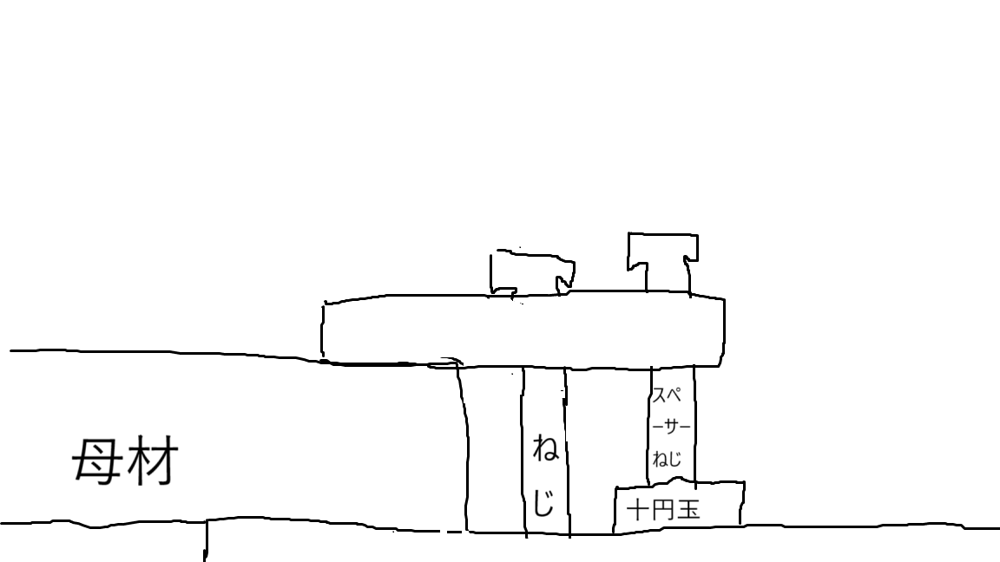
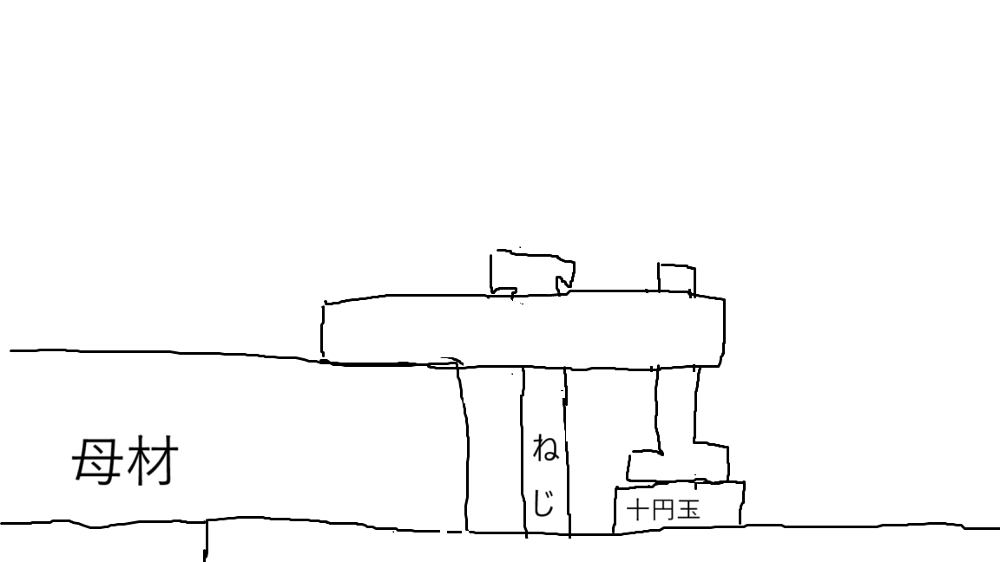
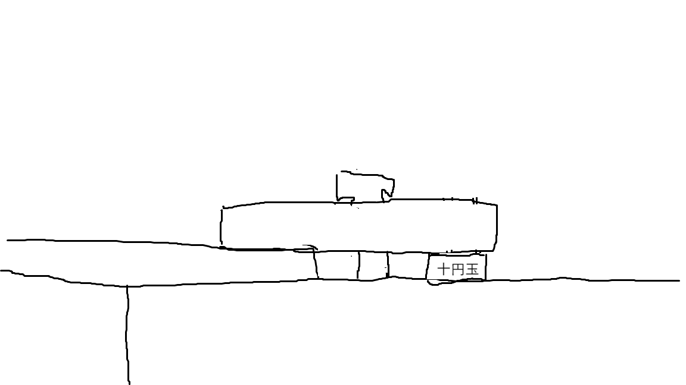
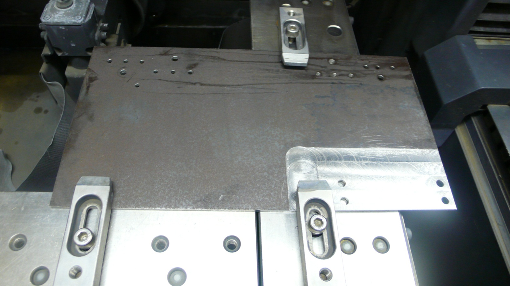
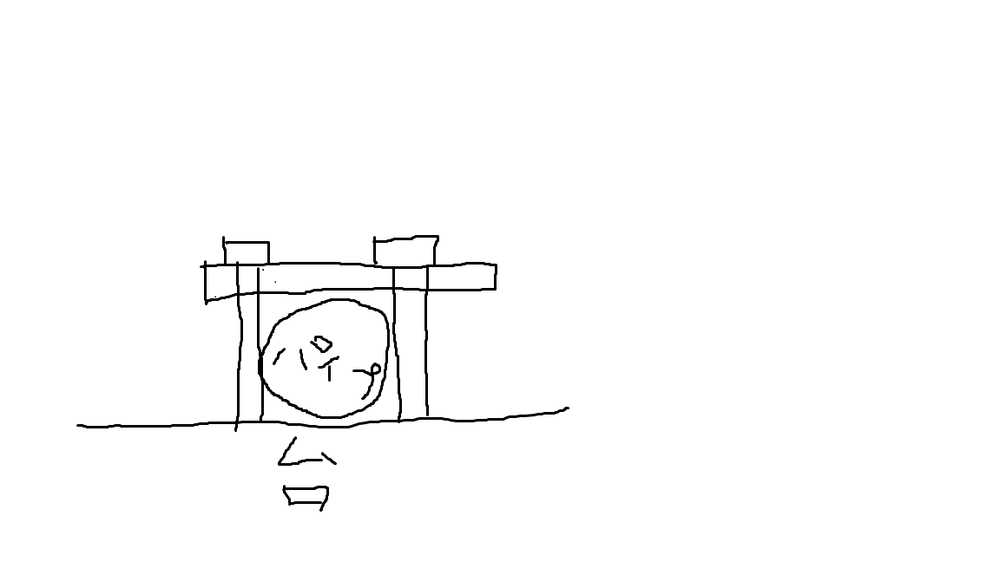
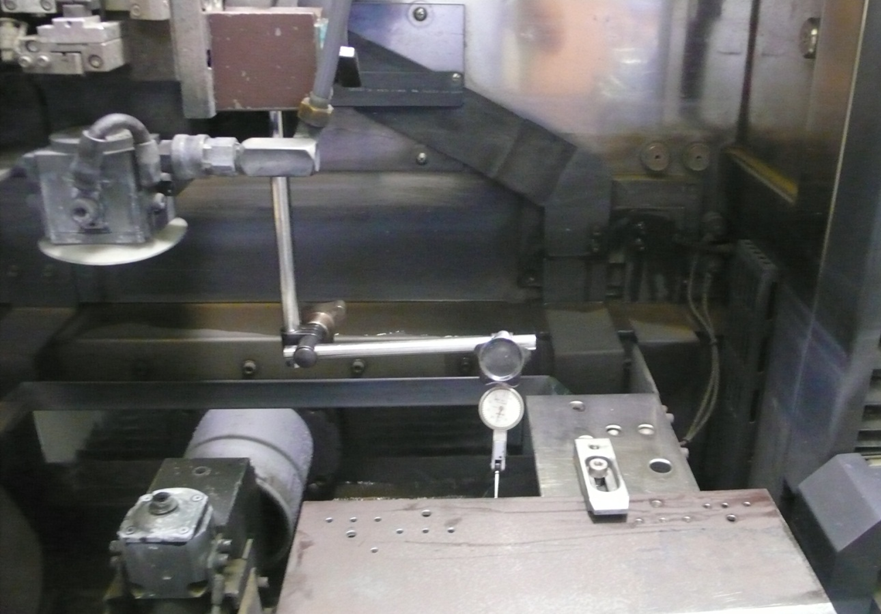
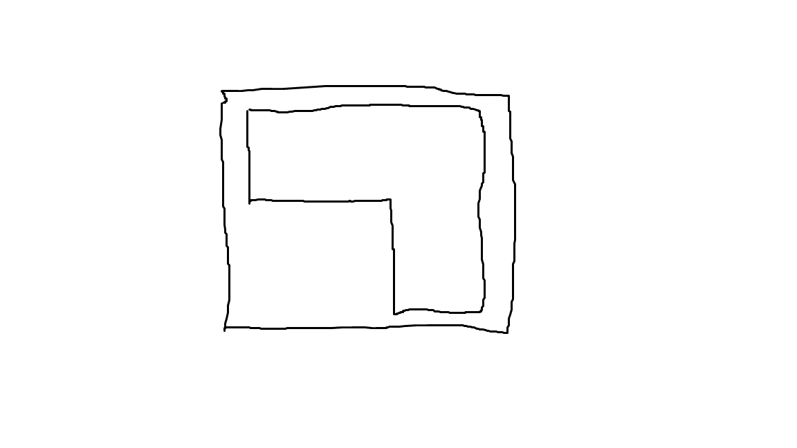
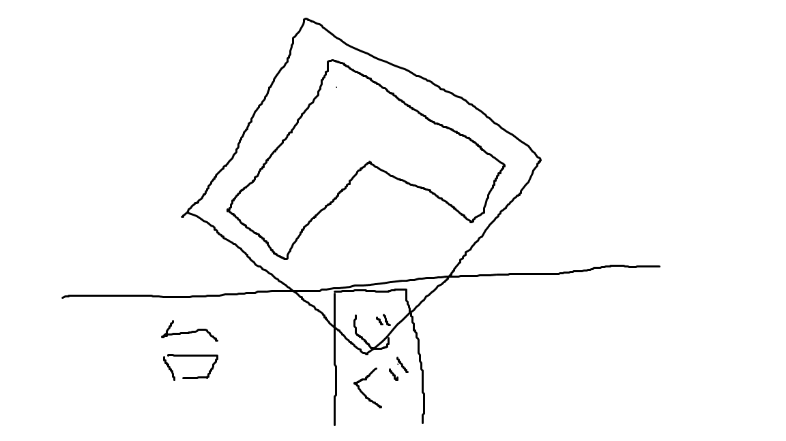

# 母材のセッティング作業
母材をどういう風に置くかという話は最後にやります。  

## 治具の使い方
母材を固定するのに、使う道具を紹介します。  
  

3種類の道具を使って固定します。  

1. ねじ  
2. 治具  
3. 十円玉(通称)  
です。  

ここで注目してほしいのが、治具には2つの穴が開いていることです。  
この2つの穴はそれぞれ役割が異なります。  

> [!NOTE]
> - 大きい楕円形の穴: 治具の締め付け用
> - 小さい穴: `スペーサー`のねじ用

## `スペーサー`ってなんや
`大きい楕円形の穴`しか使わない場合を考えてみましょう。  
ねじは基本的に母材が動かないようにしっかり締めます。するとこうなります。  
  
> 図が下手ですいません。イメージがわかない人は、実際にやってみてください。  

斜めになっちゃうと正しく加工できません。  
ということで、`スペーサー`を使います。  
  
これで母材が斜めにならずに加工できます。  
ちなみに十円玉は、ねじが加工機を傷付けないようにするために、下に当てるためのものです。  

## 治具の使い方例
1. 一番ベーシックなやつ  
  

2. ねじを逆にするやつ  
  
ちょうどよい大きさのねじがないときに使います。  

3. ねじを使わない
  
母材が薄いときに使います。  

> [!WARNING]
> スペーサーのねじの頭が出ていると、加工機のアームがぶつかりやすくなります。  
> なるべく下げましょう。  

## 母材の置き方
以下のやり方にこだわる必要はありません。  
> [!NOTE]
> とにかく動かなかったらなんでもいい。  

このスタンスで行きましょう。
> [!NOTE]
> もし無茶苦茶な固定方法になっていまっても、
> **あなたは悪くない。そんな加工を依頼したい人が悪い。**  

### 1. 普通の置き方(これが80%)

こんな感じです。  
ポイントは、
- 3点で固定する。  
- 2辺で固定する。  

こんな感じです。  
ただ、母材の大きさによって、3点で固定できなかったり、2辺で固定できなかったり、します。臨機応変に対応しましょう。  

### 2. パイプ加工の場合
これ断面図ね。横から見ると、こんな感じ。  
   
結構力強くボルトを回さないと、パイプが動いちゃいます。パイプがつぶれちゃうのは避けられません。  

### 3. 万力
#### 場所
ちょくちょく変わるからあれだけど、加工機の下の棚か図面書くPCの下のガラス棚。
見た目は木の箱。ずっしりしてます。  

#### 万力の固定方法
二種類の部品があります。万力本体と小さい楕円形の穴がついた板です。  
万力本体にも穴があいているので、そこにいつも治具を固定するのに使っているボルトを差し込んで固定します。  
ですが、その万力30万くらいするので、加工機と万力が擦れて傷ついたら大変です。  
なので、万力と加工機の間にその板を挟んで固定します。板の穴にボルトを入れる感じで。  

#### 使い方
いかにもここにはさんでねっていうやつが付いているので、そこに母材をはさみます。  
で、よく見ると万力に3箇所ボルトが付いてて回してほしそうにしてます。そのボルトを回すと、万力のアームの向きがかわります。それぞれのボルトの向きがx軸、y軸、z軸に対応してます。  
これの水平出しに、ピックゲージという下の写真のやつを使います。  
  
ダイヤルを回すと磁石がonになったり、offになったりします。  

### 4. (邪道)あえて傾ける。  
多用してはいけない邪道です。最終手段として使ってください。  
加工の例です。  
  
掴める辺がないことが分かるでしょうか？  
どの辺で掴んでも、加工の軌跡と掴むところが被ってしまいます。  
  
45度とか傾けるとこんな感じで加工できます。  
この状態で傾き補正をかけると45度の傾きで補正されるので、一応加工できるのです。  
ちなみにこのやり方でやると、加工中のプレビューがバグります。  

