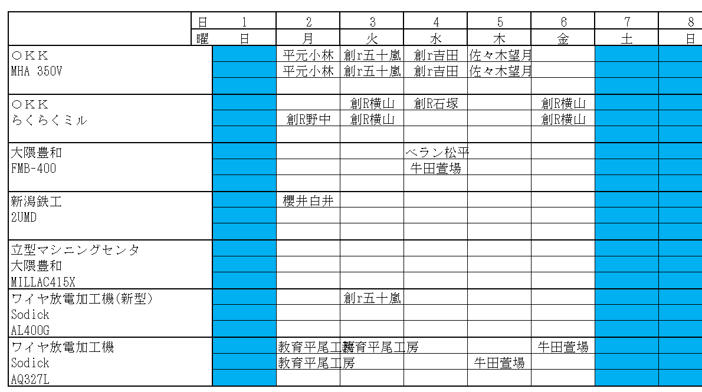
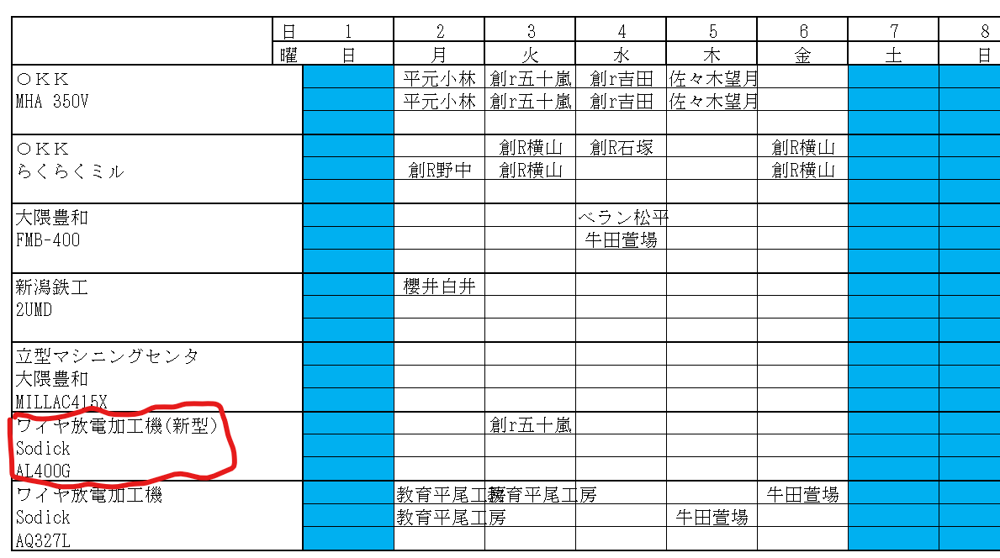
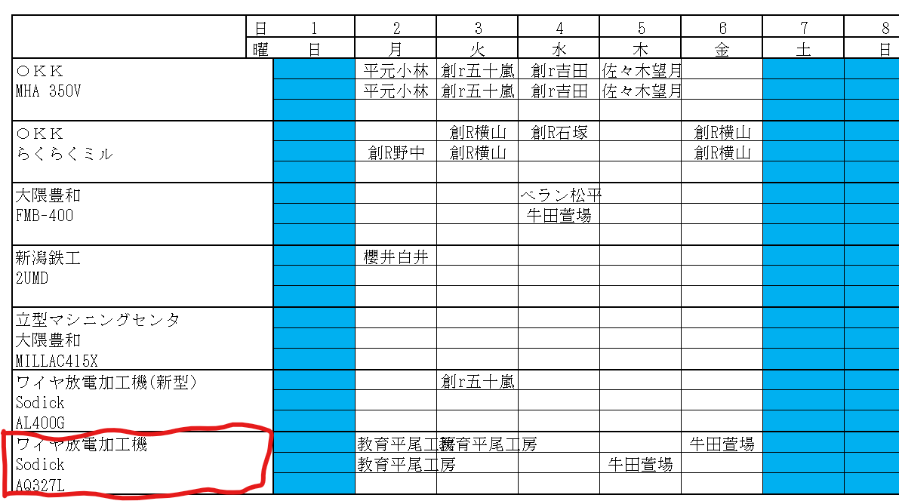

# 創造工房のルール+加工機の予約の取り方

## 創造工房のルール

- 加工機はきれいに使いましょう。(放電以外のボール盤も含む)  

> 創造工房は好意で貸していただいています。  

- 使用できる時間は平日の8:30~17:00です。(時間を超過するようなときは、技官さんに相談しましょう。)  
- 昼休みの11:45~13:00は加工できません。ちょっと11:45を過ぎる場合は、技官さんに相談しましょう。  
- 予約したけど、使わない場合は、すぐにキャンセルしに行きましょ。キャンセルしないと怒られます。  
- 予約は3日連続で予約することは、NGになっています。  
- 予約は1週間後の今日までです。それより先はできません。  
- 創造工房に入るときは、必ず作業着をちゃんと着用しましょう。  
- 創造工房でスマホを触るのは、NGです。  

## ルールの補足
### 3日連続取得禁止ルール
このルール最近定められたんですけど、割と困るルールなんですよね。  
ということで、抜け穴を教えます。  

> [!NOTE]
> 3日連続ルールは、名義を変えれば回避できます。

例えば、ロボコンの人と仲良くなっておいて、ロボコンの名前を貸してもらえばいいんです。  
ロボコンのものを頼まれて、制作しているという体にしてしまえば、3日連続でも予約できます。  
名義を貸してもらう代わりに何かロボコンのものを制作してあげるとかすればいいんじゃないですかね。  
坂本先生に事情を相談して、坂本研の名前を貸してもらってもいいかもしれません。  

### スマホ触るなルール
これがあるから先輩は創造工房でスマホを触ったことないなんてことはありません。
私は、放電加工の空いた時間を活用し、ソシャゲのリセマラを春休みの間やり続けたことで、かなり強いアカウントが手に入りました。  
何が言いたいかというと

> [!NOTE]
> スマホを触るのは、バレないようにコソコソやろう。

別に技官さんもコソコソスマホを触っていれば、わざわざ注意するようなことはないです。  
ただ、大っぴらにいじっていると怒られるので、技官さんに見えない位置でスマホを触りましょう。  

## 加工機の予約の取り方
創造工房のPCの画面はこんな感じになっています。  
  
> 若干画面が違うのは許してください。  

  
`こちらのワイヤ放電加工機(新型)`は、新型の放電加工機(通称ゲーミング放電加工機)の方です。  
> ゲーミングなのは、キラキラ光るからです。  

こっちは、学生は使用禁止です。なので、機械の予約と技官さんのアポもセットで必要です。  

ということで、普段は下の方を予約しましょう。  

後は簡単です。予約したい曜日に名前を書きましょう。  
1段目が午前で、2段目が午後です。  
3段目は使いません。  
ちなみに、名前は`学F○○`という形式にしましょう。`OO`に入る名前は、自分の名前or責任を逃れたいならリーダーの名前にしましょう。  
