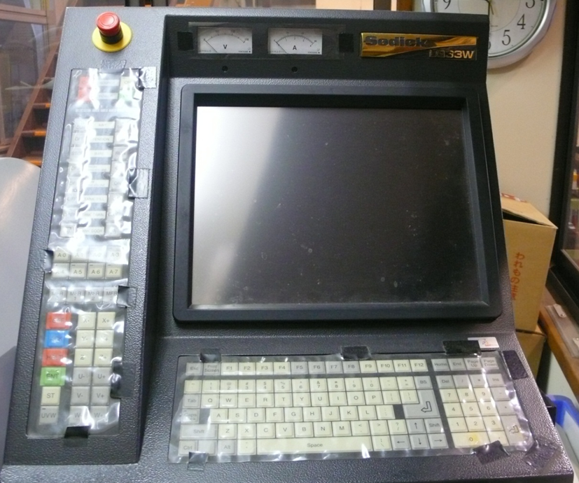
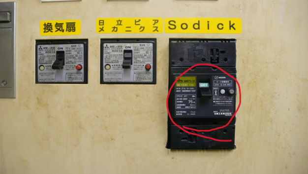

# 機械の起動

## コントロールパネルの紹介

  

これが機械の外観です。  

色々ついたPCです。  
これから放電加工をすれば、こんなに多いボタンや表示の役割もいつの間にか覚えていきます。  
なので、特に今回は覚えることはありません。  
ただし、2つだけ覚えましょう。

1つめ、  
  
> [!NOTE]
> こんなにタッチパネルっぽい見た目なのに、これはタッチパネルではありません。  

この機械についてる棚的な場所に古いマウスがあるので、それを使って操作をしましょう。  

2つめ、  
よく使うボタンを覚えましょう。  

> [!NOTE]
>   
> OFF 終了ボタンです。  
> ACK このボタンを押すように、表示が出た時に押しましょう。  
> HALT 一時停止ボタンです。  
> ENT 決定ボタンです。何かを実行するときによく押します。  

> [!CAUTION]
> OFF ボタンを押すと、加工途中でも終了します。  
> 間違って押すと、最初からやり直しになるので注意しましょう。  

## ブレーカーを付ける

  

ブレーカーをONにします。  
Sodickの方をONにします。  

  
機械の裏の主電源をONにします。

## 電源ボタンを押す
  
電源ボタンは2つあります。　　

SOURCEとPOWERの二つです。  
まずは、SOURCEをONにします。  
だいぶ待ちます。3分くらいかな。慣れてきたらこの間に別の作業をしましょう。  

この画面(`POWER ONスイッチを押してください`と表示されたら)になったら、POWERをONにします。  

## リミット移動
電源ボタンを押してからしばらくすると、以下のような画面になります。  
  

この画面(以下の順にリミット移動しますと表示)になったら、  
ENTボタンを押してください。  

すると、機械の端にアームが移動します。  

## アームのねじれの修正
ここをミスると面倒なことになります。注意しましょう。  

  
このような画面になったら、アームの位置のねじれを修正します。  

アームの位置がねじれていると、ワイヤーをはれませんからね。ワイヤーは真っ直ぐにしか張れません。  

上画像の青丸の`移動`をクリックします。この作業を忘れないようにしましょう。  

  

移動の画面になったら、青丸の`U`と`V`をクリックします。  
これで`U`と`V`が0に動くように選択されます。  

ENTボタンを押しましょう。これで、ねじれがなくなるはずです。  

### やっちまった場合
移動ではなく、原点設定のまま`U` `V`を0にすると、ねじれがとれないままになります。  
これをやると面倒くさいです。詰みです。  
唯一何とかする方法があります。それは、座標系を変えることです。  
A54かA55になってるはずなので、座標セットで違う方の座標系にいったん変えましょう。  
すると、前回の`U` `V`の位置が記憶されているはずなので、座標系を変えてからねじれを直し、座標系を変えて原点設定で`U` `V`を0にしましょう。  
